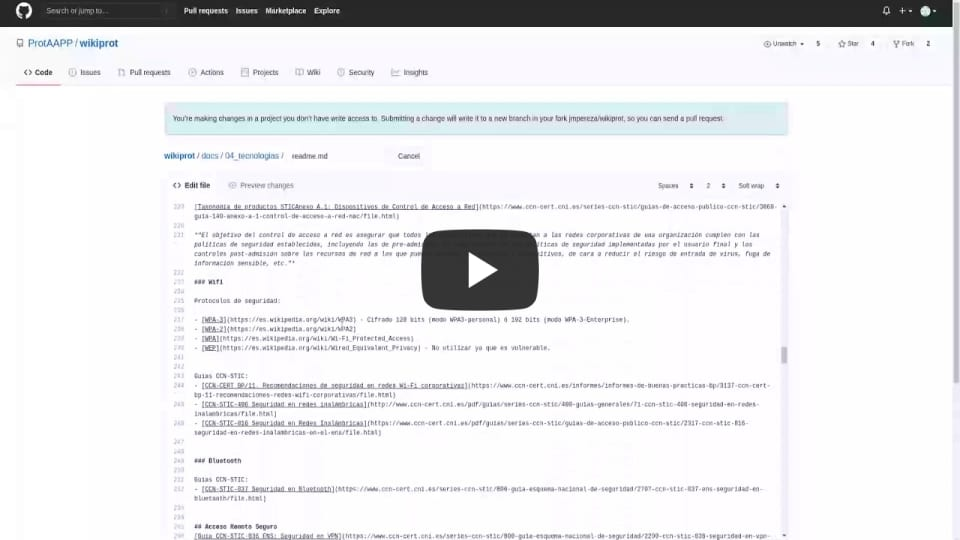

# Introducción
| :warning: Si nos visitas desde un dispositivo móvil, en las tres rayas horizontales en la parte superior izquierda puedes desplegar el menú lateral para acceder a todo el contenido.
| --- |

## La Comunidad ProtAAPP

ProtAAPP es una **comunidad** que surgió en 2018 y que integra a profesionales de las Administraciones Públicas con un denominador común: su pasión por la ciberseguridad.

ProtAAPP persigue un triple objetivo:

- Permitir la compartición de ideas, experiencias, nuevos proyectos, propuestas de colaboración, etc., en materia de ciberseguridad dentro del sector público.

- Facilitar el establecimiento de contactos y el conocimiento de otros profesionales con las mismas inquietudes y a los que poder acudir, o con los que poder colaborar.

- Ofrecer un foro de conocimiento a través del que continuar aprendiendo en múltiples sectores relacionados con la ciberseguridad: normativo, técnico, organizativo, etc.

Para hacer todo esto posible, la comunidad dispone, entre otras herramientas, de la [web](https://www.protaapp.com), a través de la que se da a conocer la comunidad y se divulga 
conocimiento de forma pública para todos los interesados, así como de una lista de distribución privada con múltiples temáticas, a través de la que los 
miembros de la comunidad realizan propuestas, debaten, consultan por experiencias similares en otros organismos, estrechan lazos, organizan quedadas y 
ejercitan a diario sus conocimientos sobre ciberseguridad.

**¿Te interesa formar parte de nuestra comunidad?** ¿Quieres ayudarnos a conseguir que nuestras Administraciones Públicas dispongan de un gran equipo de profesionales
cualificados, comunicados y cohesionados?, ¿y que podamos ofrecer un servicio público más seguro para los ciudadanos?, ¿y, por supuesto, disfrutar de toda esta experiencia?

::: tip Entra en la comunidad
No lo dudes, escríbenos a [info@protaapp.com](info@protaapp.com), ¡te esperamos!
:::

Síguenos en:

- [Twitter](https://twitter.com/protaapp) 
- [www.protaapp.com/](https://www.protaapp.com/)
- [LinkedIn](https://www.linkedin.com/company/protaapp/)
- [Github](https://github.com/ProtAAPP)
- [Grupo de Google](https://groups.google.com/group/ProtAAPP)
- Correo electrónico: [info@protaapp.com](mailto:info@protaapp.com)

### Colabora en la difusión de ProtAAPP

Si ya eres miembro, siéntete libre de utilizar nuestras [infografías](https://www.protaapp.com/p/blog-page.html) con la imagen de la comunidad en:
- Asistencia a seminarios, jornadas o congresos de seguridad.
- Sesiones de formación o confirmación.
- Documentación y propuestas.

::: tip ¿A qué estás esperando?
Quizá tienes una idea pero no te atreves a ponerla en práctica de forma individual. Ningún problema. Compártelo con la comunidad. Seguro que alguien se anima contigo.
:::

Si no puedes ser miembro, también puedes contactar con nosotros para proponer la participación en alguna de las anteriores o cualquier otra iniciativa interesante. No dudes en contactar con nosotros y si se ajusta a los objetivos de la comunidad, intentaremos ponerte en contacto con miembros que puedan estar interesados.

### Participaciones  y actividades de la comunidad
#### 2018
- SocInfo [Elige tu propia aventura - La incidencia de seguridad](https://www.slideshare.net/GuillermoObispoSanRo/elige-tu-propia-aventura-la-incidencia-de-seguridad)
#### 2019
- El Diablu (la precuela) febrero
- SocInfo [Accesos corporativos. Instrucciones de montaje (DIY)](https://www.slideshare.net/GuillermoObispoSanRo/accesos-corporativos)
- RootedCon [Zarancon City: Ciudad bastionada](https://www.youtube.com/watch?v=VJIzFuTTRb4)
- CyberCamp [Del rojo al azul](https://www.youtube.com/watch?v=WiQ1zknX-rU)
- El DiaBlu (Viernes 13) diciembre
#### 2020
- Isaca [Menú saludable para Responsables de Seguridad. Como digerir el ENS](https://www.slideshare.net/GuillermoObispoSanRo/menu-saludable-para-responsables-de-seguridad-226454626)
- RootedCon [Compliance as Code (Auditoría de infraestructura, rápida y eficiente)](https://www.youtube.com/watch?v=vODFljdavJw&t=1s)
- RootedCon [La Metacharla de Seguridad](https://www.youtube.com/watch?v=laRfJ_zYJBI)
- C1b3rWall Academy [Cimientos sólidos para Defensores](https://www.youtube.com/watch?v=hmaMOKSjw-U)
- El Diablu (?)

## Colabora con esta documentación

Este repositorio está (y estará siempre) **"en construcción"**, ya que el conocimiento en esta materia está en continua evolución.
Por esta razón, si tienes conocimientos de cualquier ámbito de la ciberseguridad, te animamos a participar en el desarrollo de este repositorio de documentación. Está construido a base de ficheros de texto plano en formato [markdown](https://markdown.es/) y las contribuciones se controlan mediante el repositorio git, en [GitHub](https://github.com/).

Este repositorio de documentación está construido con la librería [Vuepress](https://vuepress.vuejs.org/). 
El código fuente de este repositorio se encuentra en github: [ProtAAPP/wikiprot](https://github.com/ProtAAPP/wikiprot).
Consulta el [código de conducta](https://github.com/ProtAAPP/wikiprot/blob/master/code_of_conduct.md) y la [guía para contribuir](https://github.com/ProtAAPP/wikiprot/blob/master/code_contribution_guideline.md)

### Requisitos 

Los requisitos para poder colaborar en el desarrollo de esta guía son:

1. Pertenecer al colectivo de empleados públicos de las Administraciones Públicas españolas (funcionarios, laborales, etc)
2. Tener conocimientos básicos de git ([guía básica](https://medium.com/@sthefany/primeros-pasos-con-github-7d5e0769158c))
3. Tener conocimientos básicos de markdown (muy muy sencillo, [aprende lo básico en 3 minutos](./requisitos-colaborar.md#aprender-markdown-en-3-minutos))
4. Instalar [git](https://git-scm.com/downloads) en tu PC *(ó editar directamente en Github)*
5. Instalar Node en tu PC ([explicación más detallada](./requisitos-colaborar.md#instalar-node))
6. Instalar yarn ([cómo hacerlo en 10 segundos](./requisitos-colaborar.md#instalar-yarn))
7. Abrirte cuenta en Github ([crear cuenta en Github](https://github.com/join?ref_cta=Sign+up&ref_loc=header+logged+out&ref_page=%2F&source=header-home))
8. Ya estás listo para insertar tu primera aportación.

| :warning: La siguiente sección es sólo para novatos, si ya eres un maestro Jedi en esto de git salta a [Instalación para preparar el entorno](./readme.md#instalacion-para-preparar-el-entorno).
| --- |

### Para novatos (como si estuvieras en primero)
Recuerda que has de tener cuenta en Github (es gratis) para poder subir código. Aquí tienes el enlace para [crear cuenta en Github](https://github.com/join?ref_cta=Sign+up&ref_loc=header+logged+out&ref_page=%2F&source=header-home)

En caso en que sea la primera vez que oyes esto de Git y Github, esta es la manera más sencilla de colaborar vía web. En el siguiente vídeo puedes ver cómo hacerlo:

[](https://youtu.be/Se7wAVhNBeQ "Como colaborar en la wikiprot como si estuvieras en primero")

1. Abre en el navegador [Repositorio de WikiProt](https://github.com/ProtAAPP/wikiprot)
2. Selecciona la rama "develop".
3. Navega por el código hasta que encuentres el fichero que quieres modificar.
4. Editalo pulsando sobre el lápiz, si no tienes hecho login, te lo pedirá y una vez logueado ya puedes añadir o modificar.
5. Una vez que hayas terminado, añade un comentario al final y haz un "Propose Changes".
6. Comprobamos lo que se ha modificado y se hace un "Pull Request".
7. Revisaremos el código y lo antes posible estará subido al servidor.

### Instalación para preparar el entorno

Una vez cumplidos los requisitos definidos en el apartado anterior, y una vez hecho el fork lo primero es descargarse 
la última versión del repositorio, antes de modificar ningún contenido. 

Si fuera la primera vez que me descargo el repositorio:

```bash
cd /proyectos
git clone https://github.com/ProtAAPP/wikiprot.git
cd wiki-prot
yarn install    # Instalar librerías, principalmente vuepress  
```

Si por el contrario ya lo tuviera descargado, sólo hay que actualizarlo con los últimos cambios:

```bash
cd /proyectos/wikiprot
git pull                     # Traer los últimos cambios
yarn install                 # Instalar/actualizar librerías. Ejecutar siempre  
```

*(Si no tienes conocimientos suficientes de git o no puedes instalarlo, es posible utilizar Github para navegar 
a través de las carpetas del repositorio
[para editar, previsualizar y enviar contenidos.](https://docs.github.com/es/free-pro-team@latest/github/managing-files-in-a-repository/editing-files-in-your-repository))*


### Modificar contenidos del repositorio

Ahora toca **modificar los ficheros markdown** para introducir o modificar los contenidos de la guía. Gracias por aportar
tus conocimientos a la causa. Se puede utilizar cualquier editor de texto 
(notepad, [notepad++](https://notepad-plus-plus.org/downloads/), [Atom](https://atom.io/), [VSCode](https://code.visualstudio.com/), etc).   

Aunque no es estrictamente necesario, sí es muy recomendable lanzar el servidor de desarrollo de _Vuepress_, de forma que
según modificas cualquier contenido, en el momento veas cómo va quedando. Para ello:

```bash
cd /proyectos/wikiprot
yarn dev
```

Ahora abre un navegador (firefox, chrome, edge...) y entra en [http://localhost:8080](http://localhost:8080), donde podrás 
ver este repositorio. Cada vez que cambies una palabra de la documentación y guardes el fichero, el cambio se reflejará
automáticamente en el navegador.

:::warning Cuidado: El menú lateral no se actualiza automáticamente
Si introduces nuevas secciones en los ficheros markdown, para que el menú lateral "se entere" habrás de 
parar el servidor y volver a ejecutar ```yarn dev```  
:::

Si tienes dos monitores, lo suyo es tener en un monitor el programa en el que estés editando los ficheros, y en el otro
monitor tener abierto el navegador para ver cómo van quedando los cambios en el momento.

Por último, una vez finalizados los cambios, simplemente añade todo lo modificado a las "propuestas a incorporar", realiza
un commit (paquete de modificaciones), y súbelo a github:

```bash
# Situado en la raíz del proyecto (por ejemplo /proyectos/wikiprot):
git add .                     # Proponer todos ficheros modificados para próximo commit
git commit -m "Aportación X"  # Hacer commit
git push                      # Subir a Github 
```

Muchísimas gracias por aportar tu conocimiento y tiempo a este proyecto.


<!--
## La ética en la ciberseguridad

El mundo digital en el que nos encontramos, y que está sufriendo una fuerte aceleración, tiene como casi todas las cosas una 
doble cara, la de aquellos que pueden aprovechar tal potencia para hacer el mal. La implantación de la sociedad digital en todos
los ámbitos de la sociedad ha de pagar un **importante peaje: el de la seguridad**.

De acuerdo con el antiguo responsable de ciberseguridad y protección de la información del gobierno de Australia, Stephen Day, 
**la ética y la honradez deben regir las prácticas de la industria de la seguridad cibernética**.

La rapidez y la disponibilidad de los recursos generados por el desarrollo de internet y los entornos digitales han favorecido el 
crecimiento exponencial de numerosas compañías y negocios, pero los riesgos a los que estas se exponen también se han multiplicado.

Podría ocurrir que un profesional de la ciberseguridad rompa viole ciertas reglas e invada la privacidad de otros para lograr sus cometidos. 
-->

<!--
## Formación en ciberseguridad

Cursos:


Libros:


Entornos para practicar:

- [Vulnhub](https://www.vulnhub.com/) - Colección de máquinas virtuales vulnerables para jugar con ellas para hackearlas.
-->


### Organizando los contenidos

A la hora de **organizar los contenidos de este repositorio**, existe una primera jerarquía de apartados principales 
que se muestran en el menú lateral, y que está definida por el equipo que ha puesto en marcha la iniciativa. Este primer
 nivel no se puede modificar sin debatirlo, y está configurado de forma fija para el repositorio.

Dentro de cada sección principal, se podrán ir incluyendo secciones de segundo y tercer nivel, simplemente incluyendo 
títulos en markdown en los archivos _.md_. El menú del repositorio se construye dinámicamente para adaptarse al contenido de 
los ficheros _.md_, razón por la cual existe mucha más libertad para este tipo de subapartados.

**Cada sección** en principio debe seguir una estructura aproximada a la siguiente:

1. **Descripción concisa, clara y breve del concepto**. Aunque pueda parecerte algo evidente, no todo el mundo conoce o está 
   familiarizado con todos los conceptos de seguridad. Por esta razón, es recomendable iniciar cada sección con una breve descripción.

2. En su caso, y de forma opcional, un mayor desarrollo explicativo.

3. **Referencias importantes** que permitan profundizar sobre el tema, con un objetivo didáctico. Pueden ser referencias 
   a la wikipedia, a artículos de calidad u otros enlaces que permitan obtener un conocimiento más profundo.

4. **Herramientas** y productos útiles relacionados con la sección. Debe indicarse de forma clara **si son gratuitos**, 
   de software libre, o tienen algún coste o limitación. Estas herramientas deben ser referenciadas con un enlace a su
   página oficial.

5. Desarrollos en mayor profundidad. Si se desea incluir en WikiProt un mayor desarrollo de algún concepto o herramienta,
   lo adecuado es hacerlo en otro fichero markdown que se referencie desde este punto. Por ejemplo, podrían incluirse ejemplos
   de configuraciones de un servidor web, o trozos de código fuente explicando cómo se lleva a la práctica un concepto en
   varios lenguajes de programación, o el detalle de cómo fue un evento de ProtAAPP con sus fotos y presentaciones.

6. Es muy valioso incluir "tips", "warnings" o mensajes de advertencia "danger" para alertar sobre trucos, consejos, 
   avisos o peligros a conocer. Por ejemplo, este "tip":
   
::: tip Vas por buen camino
Esta sección es de obligada lectura antes de aportar tu granito de arena. Por cierto, ¡muchas gracias!
:::   
   
**EL buscador** del repositorio sólo busca en los títulos de las secciones. no busca en el contenido de los ficheros markdown. 
Esto puede sorprender al principio, pero es una buena idea. 

::: tip Dedica tiempo a pensar bien el título de cada sección
Para que las cosas se encuentren bien con el buscador hay que **incluir las palabras clave en el título de las secciones**.
:::


### Asuntos por desarrollar
Podéis contribuir al repositorio con cualquier contenido que consideréis interesante. No obstante, aquí enumeramos algunos contenidos que tenemos pendientes desarrollar o profundizar:
- [Estrategias, planes y experiencias en implantación ENS](http://wikiprot.protaapp.com/03_gestion/#esquema-nacional-de-seguridad-para-organizaciones-publicas-en-espana)
- Comparativa entre controles de los diferentes frameworks.
- [Seguridad en Bases de Datos](http://wikiprot.protaapp.com/04_tecnologias/#bases-de-datos)
- ...


