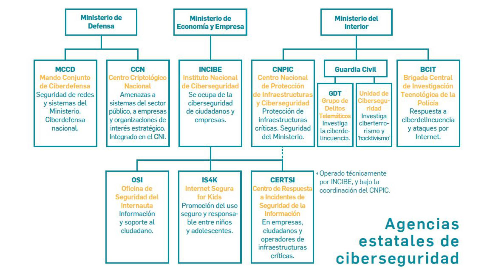
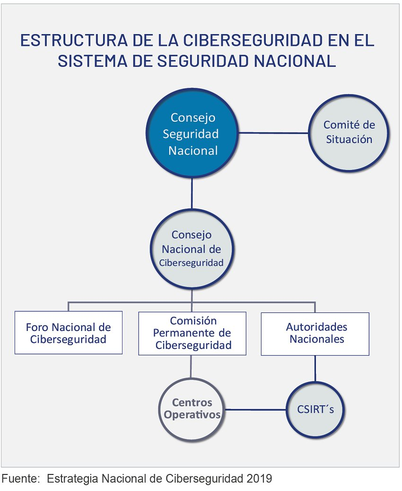

# Normativa y Organismos

[[TOC]]

## Normativa sobre Ciberseguridad

### Normativa sobre Ciberseguridad en España

En el [Código de Derecho de la Ciberseguridad](https://www.boe.es/biblioteca_juridica/codigos/codigo.php?id=173&modo=1&nota=0&tab=2)
publicado en el BOE puede encontrarse un amplio índice a todas las normas relacionadas con la seguridad 
informática.

- Estrategias:
    - [2017. Estrategia de Seguridad Nacional](https://www.dsn.gob.es/estrategias-publicaciones/estrategias/estrategia-seguridad-nacional-2017)
    - [2019. Estrategia Nacional de Ciberseguridad](https://www.dsn.gob.es/documento/estrategia-nacional-ciberseguridad-2019)

- Normativa de alto nivel:
    - [RD 3/2010](https://www.boe.es/buscar/act.php?id=BOE-A-2010-1330) Esquema Nacional de Seguridad en el ámbito de la Administración Electrónica.
    - [RD 12/2018](https://www.boe.es/diario_boe/txt.php?id=BOE-A-2018-12257) Seguridad de las redes y sistemas de información (trasposición de la directiva NIS)
    - [RD 4/2010](https://www.boe.es/buscar/act.php?id=BOE-A-2010-1331) Esquema Nacional de Interoperabilidad
    - [Ley 8/2011](https://www.ccn-cert.cni.es/publico/InfraestructurasCriticaspublico/Ley82011-de28deabril-PIC.pdf) Protección
de las infraestructuras críticas.
    - [Ley 36/2015](https://www.boe.es/buscar/act.php?id=BOE-A-2015-10389) Seguridad Nacional

- Instrucciones Técnicas de Seguridad (ITS):
    - [ITS de Notificación de Incidentes de Seguridad]()
    - [ITS de Auditoría de la Seguridad de los Sistemas de Información]()
    - [ITS de conformidad con el Esquema Nacional de Seguridad]()
    - [ITS de Informe del Estado de la Seguridad]()

- Reglamentos:
    - [Orden PRE/2740/2007](https://www.boe.es/buscar/act.php?id=BOE-A-2007-16830) Reglamento de Evaluación y Certificación de la Seguridad TIC

### Normativa sobre Protección de datos en España:

- [Ley Orgánica 3/2018](https://www.boe.es/buscar/act.php?id=BOE-A-2018-16673) Protección de Datos Personales y garantía de los derechos digitales
<!--
- [RD 1720/2007](https://www.boe.es/buscar/act.php?id=BOE-A-2008-979) Reglamento de desarrollo de protección de datos de carácter personal
-->

### Normativa europea
- [2016. Directiva NIS](https://www.boe.es/doue/2016/194/L00001-00030.pdf)
- [2016. Reglamento Europeo de Protección de Datos](https://www.boe.es/doue/2016/119/L00001-00088.pdf)

## Organismos Públicos con competencias en Ciberseguridad
### España

* Estructura de la Ciberseguridad en el Sistema de Seguridad Nacional

### Europa
- [ENISA](https://www.enisa.europa.eu/). 

 

