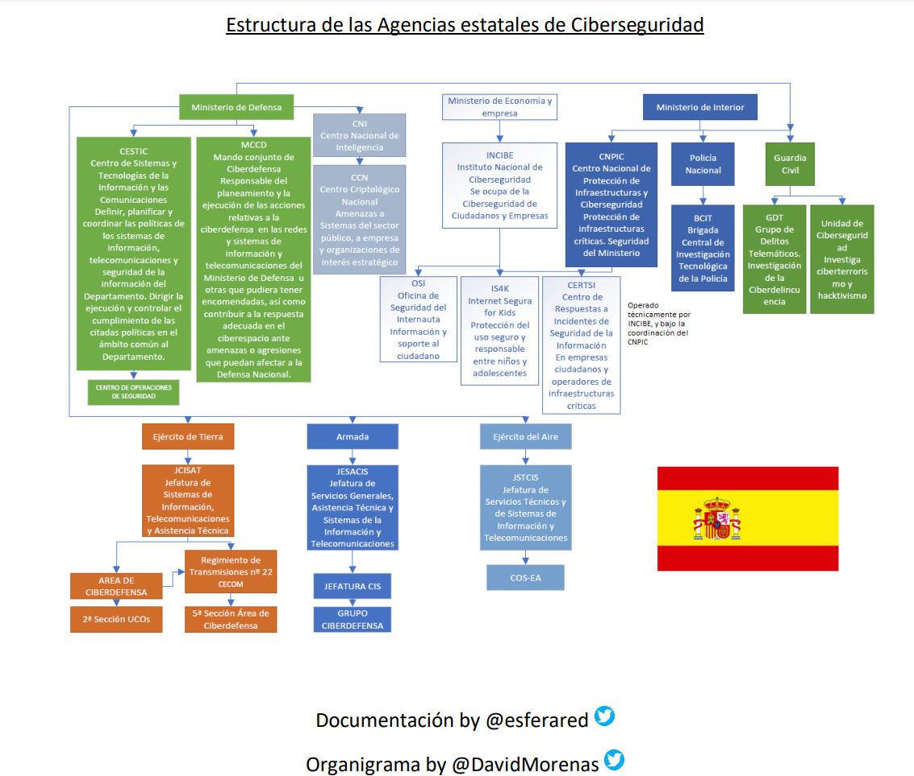

# Normativa y Organismos

[[TOC]]

<!-- https://www.akamai.com/es/es/about/compliance/ -->

## Normativa sobre Ciberseguridad
### Normativa sobre Ciberseguridad en España
En el [Código de Derecho de la Ciberseguridad](https://www.boe.es/biblioteca_juridica/codigos/codigo.php?id=173&modo=1&nota=0&tab=2) publicado en el BOE puede encontrarse un amplio índice a todas las normas relacionadas con la ciberseguridad.

- Estrategias:
    - [2019. Estrategia Nacional de Ciberseguridad](https://www.dsn.gob.es/documento/estrategia-nacional-ciberseguridad-2019)
    - [2021. Estrategia de Seguridad Nacional](https://www.boe.es/buscar/act.php?id=BOE-A-2021-21884)

- Normativa de alto nivel:
    - [RD 311/2022](https://www.boe.es/diario_boe/txt.php?id=BOE-A-2022-7191) Esquema Nacional de Seguridad en el ámbito de la Administración Electrónica.
    - [RD 12/2018](https://www.boe.es/diario_boe/txt.php?id=BOE-A-2018-12257) Seguridad de las redes y sistemas de información (transposición de la directiva NIS)
    - [RD 14/2019](https://www.boe.es/buscar/act.php?id=BOE-A-2019-15790) Medidas urgentes por razones de seguridad pública en materia de administración digital, contratación del sector público y telecomunicaciones.
    - [RD 4/2010](https://www.boe.es/buscar/act.php?id=BOE-A-2010-1331) Esquema Nacional de Interoperabilidad
    - [Ley 8/2011](https://www.ccn-cert.cni.es/publico/InfraestructurasCriticaspublico/Ley82011-de28deabril-PIC.pdf) Protección
de las infraestructuras críticas.
    - [Ley 36/2015](https://www.boe.es/buscar/act.php?id=BOE-A-2015-10389) Seguridad Nacional

- [Instrucciones Técnicas de Seguridad (ITS)](https://administracionelectronica.gob.es/pae_Home/pae_Estrategias/pae_Seguridad_Inicio/Instrucciones-Tecnicas.html):
    - [ITS de Notificación de Incidentes de Seguridad](http://www.boe.es/diario_boe/txt.php?id=BOE-A-2018-5370)
    - [ITS de Auditoría de la Seguridad de los Sistemas de Información](https://www.boe.es/diario_boe/txt.php?id=BOE-A-2018-4573)
    - [ITS de conformidad con el Esquema Nacional de Seguridad](http://www.boe.es/diario_boe/txt.php?id=BOE-A-2016-10109)
    - [ITS de Informe del Estado de la Seguridad](http://www.boe.es/diario_boe/txt.php?id=BOE-A-2016-10108)

- Reglamentos:
    - [Orden PRE/2740/2007](https://www.boe.es/buscar/act.php?id=BOE-A-2007-16830) Reglamento de Evaluación y Certificación de la Seguridad TIC

### Normativa sobre Protección de datos en España
- [Ley Orgánica 3/2018](https://www.boe.es/buscar/act.php?id=BOE-A-2018-16673) Protección de Datos Personales y garantía de los derechos digitales

### Normativa europea
- Privacidad
    - [2016/679 Reglamento Europeo de Protección de Datos](https://www.boe.es/doue/2016/119/L00001-00088.pdf)
    - [2016/680 Reglamento Europeo de Protección de Datos por parte de las autoridades competentes](https://www.boe.es/doue/2016/119/L00089-00131.pdf)
- Ciberseguridad
    - [2019/881 relativo a ENISA y a la certificación de la ciberseguridad](https://eur-lex.europa.eu/legal-content/ES/TXT/?uri=CELEX%3A32019R0881)
    - [2016/1148 Directiva NIS](https://www.boe.es/doue/2016/194/L00001-00030.pdf)
- Sectoriales
    - Servicios de pago: [PSD2](https://ec.europa.eu/info/law/payment-services-psd-2-directive-eu-2015-2366_en)

### Normas ISO
- [Serie 27000](https://es.wikipedia.org/wiki/ISO/IEC_27000-series)
- [ISO/IEC 27018:2019 Protección de datos personales en la nube](https://www.iso.org/standard/76559.html)
- [ISO/IEC 27701:2019 Gestión de la información de privacidad](https://www.iso.org/standard/71670.html)
- [ISO/IEC 29184:2020 Aviso de privacidad online y consentimiento](https://www.iso.org/standard/70331.html)
- [ISO/IEC 27102:2019 Gestión de seguridad de la información – Guía para ciberseguros](https://www.iso.org/standard/72436.html)
- [ISO/IEC 19086-4:2019 SLA Cloud computing–Componentes de seguridad y protección de datos personales](https://www.iso.org/standard/68242.html)
- [ISO 22301:2019 Continuidad del negocio](https://www.iso.org/standard/75106.html)

### Acuerdos transnacionales
- [Privacy Shield](https://www.privacyshield.gov/welcome) EU, Suiza y USA. [Invalidado](https://curia.europa.eu/jcms/upload/docs/application/pdf/2020-07/cp200091es.pdf) por el Tribunal de Justicia de la Unión Europea.

### Normativa de otros paises
- [Legislación que hay actualmente sobre cibercrimen, protección de datos, e-transactions y protección del consumidor digital](https://derechodelared.com/los-mapas-de-las-ciberleyes/)
- Leyes sobre Ciberseguridad:
    - Alemania [Ley BSI](https://www.bsi.bund.de/EN/TheBSI/BSIAct/bsiact_node.html)

Marcos de controles sobre ciberseguridad
* USA [NIST](https://www.nist.gov/) [SP800-53](https://nvd.nist.gov/800-53) [FedRAMP](https://www.fedramp.gov/)

Regulación sobre privacidad:
* USA [CCPA](https://oag.ca.gov/privacy/ccpa)
* Canada [PIPEDA](https://www.priv.gc.ca/en/privacy-topics/privacy-laws-in-canada/the-personal-information-protection-and-electronic-documents-act-pipeda/)
* Brasil [LGPD](https://gdpr.eu/gdpr-vs-lgpd)
* Australia [ADPR](https://www.oaic.gov.au/privacy-law/privacy-act/)
* Sudáfrica [POPI](https://popia.co.za/)
* Singapur [MAS](https://www.mas.gov.sg/-/media/MAS/Regulations-and-Financial-Stability/Regulatory-and-Supervisory-Framework/Risk-Management/Outsourcing-Guidelines_Jul-2016-revised-on-5-Oct-2018.pdf)
* USA (Servicios sanitarios y Seguros) [HIPAA](https://aspe.hhs.gov/report/health-insurance-portability-and-accountability-act-1996)

Estrategias nacionales de Ciberseguridad:
- [Australia's Cyber Security Strategy 2020](https://www.homeaffairs.gov.au/cyber-security-subsite/files/cyber-security-strategy-2020.pdf)
- [USA National Cyber Strategy. 2018](https://www.whitehouse.gov/wp-content/uploads/2018/09/National-Cyber-Strategy.pdf)
- [UK National Cyber Security Strategy 2016-2021.](https://assets.publishing.service.gov.uk/government/uploads/system/uploads/attachment_data/file/567242/national_cyber_security_strategy_2016.pdf)
- [Francia. French National Digital Security Strategy](https://www.ssi.gouv.fr/uploads/2015/10/strategie_nationale_securite_numerique_en.pdf)
- [National Capabilities Assessment Framework](https://www.enisa.europa.eu/publications/national-capabilities-assessment-framework) ENISA.

Proyectos normativos en otros paises:
- [Proyecto de ley sobre ciberseguridad en IoT en USA](https://www.congress.gov/bill/116th-congress/senate-bill/734?q=%7B%22search%22%3A%5B%22Internet+of+Things)

### Normativa impulsada por el sector privado
Pagos electrónicos [PCI-DSS](https://es.pcisecuritystandards.org/pci_security/) Payment Card Industry Data Security Standards

## Organismos Públicos con competencias en Ciberseguridad
### España

<!--  -->

 [Fuente](https://www.pabloyglesias.com/listado-agencias-ciberseguridad-espana/) by [@esferared](https://twitter.com/ESFERARED/status/1151418991073779713?s=20) & [@davidmorenas](https://twitter.com/davidmorenas)

* Estructura de la [Ciberseguridad en el Sistema de Seguridad Nacional](https://www.dsn.gob.es/es/sistema-seguridad-nacional/qu%C3%A9-es-seguridad-nacional/%C3%A1mbitos-seguridad-nacional/ciberseguridad) 

[Foro Nacional de Ciberseguridad](https://foronacionalciberseguridad.es/)

### Europa
- [ENISA](https://www.enisa.europa.eu/)
