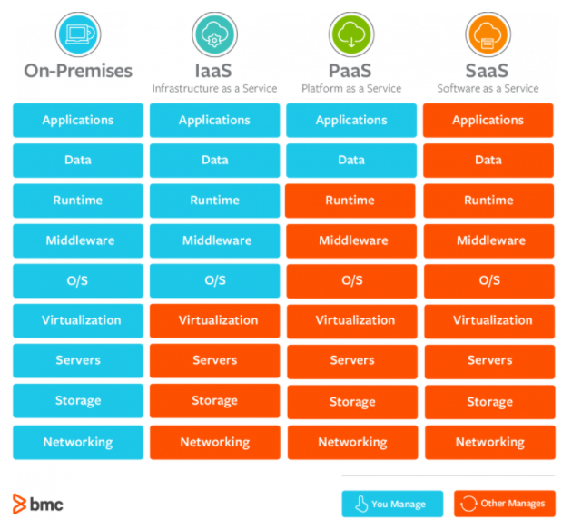
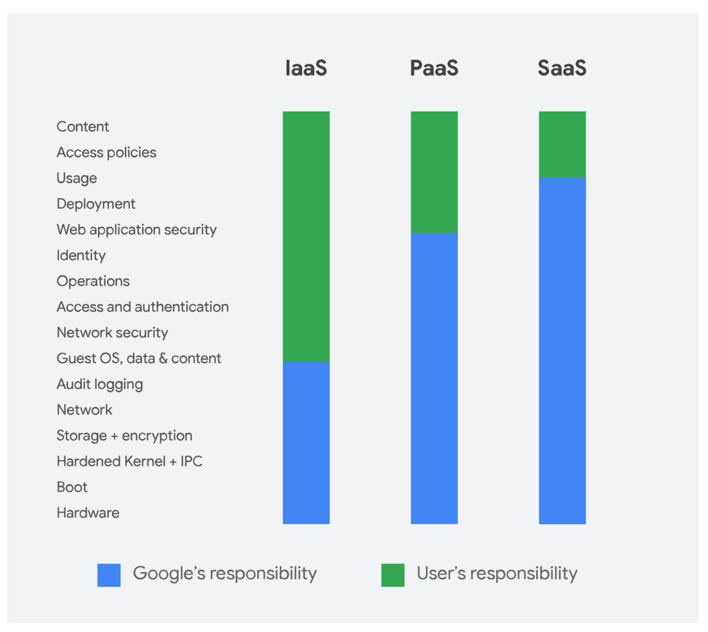
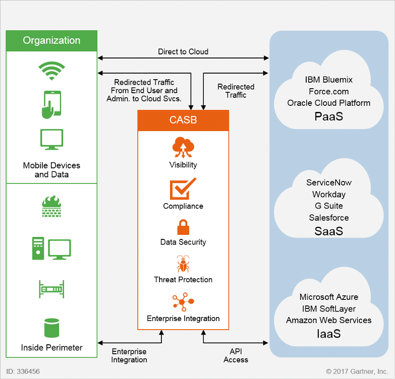
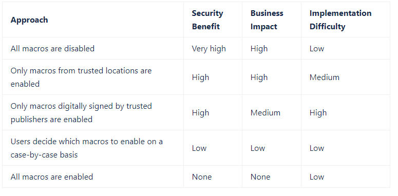

# Protección: Arquitecturas, Tecnologías y Bastionado

[[TOC]]

## Principios para una construcción segura 

### Segmentación de la red
Desde una perspectiva de seguridad, la segmentación (o segregación) de redes, trata de garantizar que los servicios y los datos puedan protegerse de manera acorde con su sensibilidad o valor para el negocio, y también asegurar que los atacantes no puedan acceder a la red completa, en caso de que ocurra una brecha de seguridad. Además, también proporciona una defensa efectiva en profundidad en términos de proporcionar obstáculos adicionales que los atacantes deben superar para acceder a ciertos tipos de datos.
En una red plana, un atacante que consigue acceso o posibilidad de ejecución, podrá alcanzar TODOS los equipos conectados, posibilitando el movimiento lateral. Esto no sucede así, en una red debidamente segmentada o segregada.

Ver también [Modelos de interconexión según la guía CCN-STIC-811](#modelos-de-interconexion-segun-la-guia-ccn-stic-811)

### Mínimo privilegio
El principio de mínimo privilegio es un concepto esencial en seguridad. La idea del mínimo privilegio es que cualquier usuario, aplicación, etc. debe tener solo los derechos y privilegios mínimos necesarios para realizar su función. Por ejemplo, los usuarios del departamento financiero no deberían tener el mismo nivel de acceso que los usuarios del departamento de ingeniería.

El privilegio mínimo ayuda a reducir la superficie de ataque al eliminar los derechos y privilegios innecesarios que pueden provocar incidentes de seguridad, como una violación de datos importante. Por ejemplo, la Agencia de Seguridad Nacional (NSA) tuvo que reducir el número de personas que tenían acceso a información secreta después de que Edward Snowden filtrara datos clasificados.

Las organizaciones también deben implementar verificaciones periódicas, posiblemente anuales, para detectar cualquier tipo de privilegio. La idea es evitar una acumulación gradual de derechos y privilegios más allá de lo que el sujeto necesita para realizar su función.

### Defensa en profundidad
Se refiere a un enfoque de seguridad de la información en el que una serie de mecanismos y controles de seguridad se colocan cuidadosamente para proteger la confidencialidad, integridad y disponibilidad de la red y los datos que contiene. Si bien ninguna mitigación individual puede detener todas las amenazas cibernéticas, juntas proporcionan mitigaciones contra una amplia variedad de amenazas al tiempo que incorporan redundancia en caso de que un mecanismo falle. Cuando tiene éxito, este enfoque refuerza significativamente la seguridad de la red contra muchos vectores de ataque.

Varias capas de control proporcionan:
* Múltiples oportunidades para que la monitorización detecte el ataque.
* Controles adicionales que el atacante debe superar, lo que crea un retraso que puede interrumpir o prevenir el ataque.
* A menudo es importante utilizar varios controles para proteger un activo. El número y tipos de capas necesarios es una función de cosas como:
   * Valor de los activos y criticidad
   * La confiabilidad de cada control
   * El grado de exposición

La defensa en profundidad también se puede ver en términos de arquitectura:
* DEFENSA HORIZONTAL EN PROFUNDIDAD
   * Los controles se colocan en varios lugares en la ruta de acceso para un activo
* DEFENSA VERTICAL EN PROFUNDIDAD
   * Los controles se colocan en diferentes capas del sistema
   * Estas capas incluyen hardware, sistema operativo, aplicación, base de datos o niveles de usuario.

### Monitorización
Con el panorama de amenazas en constante evolución, la monitorización no debería ser algo a configurar "a posteriori", sino que debería ser una de las primeras estrategias de defensa en la lista. Es fundamental disponer de la capacidad de monitorizar su red en busca de amenazas de seguridad, vulnerabilidades, comportamientos sospechosos, etc., y responder adecuadamente cuanto antes.

La mayoría de las brechas de seguridad tarda meses o más en descubrirse. En muchos casos, un tercero, como la policía o un colaborador, descubre la brecha. El peor de los casos es cuando los clientes detectan la brecha.

### Autenticación multifactor
La autenticación multifactor (MFA) o la autenticación de dos factores (2FA) es cuando se requiere que un usuario presente más de un tipo de evidencia para autenticarse en un sistema. Hay cuatro tipos diferentes de evidencia (o factores) que se pueden utilizar:
- Algo que sabe:  contraseñas, PIN y preguntas de seguridad.
- Algo que tenga: tokens de hardware o software, certificados, correo electrónico, SMS y llamadas telefónicas.
- Algo que eres: huellas dactilares, reconocimiento facial, escaneos de iris y escaneos de huellas de manos.
- Geolocalización y rangos de IP de origen de ubicación.

Es importante resaltar que, requerir múltiples ejemplos de un solo factor (por ejemplo contraseña + PIN), no constituye MFA, aunque puede proporcionar algunos beneficios de seguridad sobre una contraseña simple.

Aunque algunos factores son más seguros que otros, es importante señalar que "cualquier MFA es mejor que ningún MFA".

Recursos interesantes:
- [Multifactor Authentication Cheat Sheet by OWASP](https://cheatsheetseries.owasp.org/cheatsheets/Multifactor_Authentication_Cheat_Sheet.html)
- [Google data shows 2-factor authentication blocks 100% of automated bot hacks](https://security.googleblog.com/2019/05/new-research-how-effective-is-basic.html)

### Criptografía

Para que los datos estén seguros, deben estar protegidos durante todo su ciclo de vida. Por tanto, es importante tener en cuenta el estado de los datos que está intentando proteger:
* Datos en movimiento: transmitidos a través de una red.
* Datos en reposo: en su almacenamiento o en equipos de escritorio, portátiles, teléfonos móviles, tabletas y dispositivos Iot.
* datos en uso: en proceso de ser generados, actualizados, borrados o visualizados.

Cada tipo de datos presenta desafíos únicos. Y cada uno puede tener diferentes herramientas y metodologías que se pueden utilizar para asegurarlo.

Los tipos de cifrado para datos en reposo incluyen los siguientes:
* Cifrado de disco completo (FDE) para protección de endpoints.
* Cifrado de disco completo con autenticación previa al arranque para protección de endpoints.
* Módulo de seguridad de hardware (HSM) para la protección del ciclo de vida de la gestión de claves.
* Sistema de cifrado de archivos (EFS) para proteger el almacenamiento.
* Cifrado virtual para la protección del almacenamiento.
* Cifrado de archivos y carpetas (FFE) para protección de datos no estructurados.
* Cifrado de base de datos para protección de datos estructurados.

Los tipos de cifrado para datos en movimiento incluyen (pero no se limitan a) los siguientes:
* Red privada virtual (VPN) para acceso remoto
* Acceso protegido Wi-Fi (WPA / WPA2 / WPA3) para acceso inalámbrico.
* Capa de sockets seguros (SSL) para las comunicaciones del navegador web al servidor.
* Secure Shell (SSH) para la administración segura de sistemas remotos.

[Criptografía de empleo en el Esquema Nacional de Seguridad](https://www.ccn-cert.cni.es/series-ccn-stic/800-guia-esquema-nacional-de-seguridad/513-ccn-stic-807-criptologia-de-empleo-en-el-ens/file.html) Guía del CCN que presenta los algoritmos criptográficos que han sido acreditados para su uso en el ENS, así como parámetros de los mismos (versiones, tamaño de claves...).

#### Conceptos y recursos
Recursos interesante:
- Certificación en criptografía: [CryptoCert](https://www.criptocert.com/)
- [Curso sobre criptografía de criptored](https://www.youtube.com/watch?v=rm8W5XD3lUg)
- [Hashing vs. Encryption vs. Encoding vs. Obfuscation](https://danielmiessler.com/study/encoding-encryption-hashing-obfuscation/)
- [Criptografía en el mundo real](https://cmr.e-paths.com/) Libro de Gonzalo Álvarez Marañón, Área de Innovación y Laboratorio. Eleven Paths.
- [Crypto Go Game](https://www.cryptogogame.com/ES/juego) - Juego de cartas educativo sobre criptografía simétrica actual. El principal objetivo de _Crypto Go_ es   familiarizar a los jugadores de una manera lúdica y social con las principales herramientas criptográficas actuales,  su nivel de seguridad, y la forma correcta de combinarlas.

### Copias de Seguridad
Todos los responsables de sistemas y/o usuarios deben respaldar los datos críticos que tienen en sus equipos de escritorio, portátiles, servidores e incluso dispositivos móviles para protegerlos de pérdidas o corrupción. Guardar solo un archivo de respaldo puede no ser suficiente para salvaguardar
la información. Para aumentar las posibilidades de recuperar datos perdidos o dañados, siga una estrategia 3-2-1:
* 3 - Guarde 3 copias de cualquier archivo importante: 1 principal y 2 copias de seguridad.
* 2 - Mantenga los archivos en 2 tipos de medios diferentes para protegerlos contra diferentes tipos de peligros.
* 1 - Guarde 1 copia fuera del sitio (por ejemplo, fuera de su hogar o instalación comercial).

[US-CERT Data Backup Options](https://us-cert.cisa.gov/sites/default/files/publications/data_backup_options.pdf)

### Zero Trust
Se trata de un modelo de seguridad introducido por [John Kindervag en 2010](https://media.paloaltonetworks.com/documents/Forrester-No-More-Chewy-Centers.pdf) que se aleja de la vieja mentalidad de seguridad perimetral. Básicamente, las organizaciones no deben confiar automáticamente en nada dentro de su perímetro y, en cambio, siempre deben verificar todo lo que intenta conectarse a sus sistemas antes de otorgar acceso.

El enfoque tradicional de seguridad de red de muchas organizaciones se basa en el concepto de castillo y foso, que se denomina seguridad perimetral. En este enfoque, las organizaciones se concentran en proteger su red desde el exterior, pero se confía en todos los que están dentro. La falla de este enfoque es que una vez que los ciberdelincuentes obtienen acceso a la red, son libres de causar estragos.

### Secure Access Service Edge (SASE)
Secure Access Service Edge o SASE (pronunciado "sassy"), es un concepto emergente de ciberseguridad que Gartner describió en el informe de agosto de 2019, El futuro de la seguridad de la red en la nube [The Future of Network Security Is in the Cloud](https://blogs.gartner.com/andrew-lerner/2019/12/23/say-hello-sase-secure-access-service-edge/)

Antes de sumergirse en los detalles de SASE, es importante entender un poco los antecedentes de este nuevo término. Los enfoques y tecnologías de red existentes simplemente ya no proporcionan los niveles de seguridad y control de acceso que las organizaciones digitales necesitan. Estas organizaciones demandan acceso inmediato e ininterrumpido para sus usuarios, sin importar donde se encuentren. Con el aumento de los usuarios remotos y las aplicaciones de software como servicio (SaaS), el traslado de datos del centro de datos a los servicios de la nube y el aumento del tráfico que se dirige a los servicios públicos de la nube y a las sucursales en lugar de volver al centro de datos, ha aumentado la necesidad de un nuevo enfoque para la seguridad de la red.

SASE es la convergencia de la red de área amplia, o WAN, y los servicios de seguridad de red como CASB, FWaaS y Zero Trust, en un único modelo de servicio entregado en la nube. De acuerdo con Gartner, "las capacidades de SASE se entregan como un servicio basado en la identidad de la entidad, el contexto en tiempo real, las políticas de seguridad/cumplimiento de la empresa y la evaluación continua de riesgo/confianza a lo largo de las sesiones. Las identidades de las entidades pueden asociarse con personas, grupos de personas (sucursales), dispositivos, aplicaciones, servicios, sistemas de IO o ubicaciones de computación de punta".

Gartner espera que, "para el 2024, al menos el 40% de las empresas tendrán estrategias explícitas para adoptar SASE, frente a menos del 1% a finales de 2018". Una arquitectura SASE identifica a los usuarios y dispositivos, aplica la seguridad basada en políticas y ofrece acceso seguro a la aplicación o datos apropiados. Este enfoque permite a las organizaciones aplicar el acceso seguro sin importar dónde se encuentren sus usuarios, aplicaciones o dispositivos.

## Productos revisados por organismos independientes

### Catálogo de Productos de Seguridad de las Tecnologías de la Información y la Comunicación
El CCN publica este catálogo (CPSTIC) con el objetivo de ofrecer a los organismos de la Administración un conjunto de productos STIC de referencia cuyas funcionalidades de seguridad relacionadas con el objeto de su adquisición han sido certificadas.

- [CCN-STIC-105 Catálogo CPSTIC](https://www.ccn-cert.cni.es/pdf/guias/series-ccn-stic/guias-de-acceso-publico-ccn-stic/2536-ccn-stic-105-catalogo-de-productos-de-seguridad-de-las-tecnologias-de-la-informacion-y-la-comunicacion/file.html)
- [CCN-STIC 140 Taxonomías de referencia para productos de seguridad TIC](https://www.ccn-cert.cni.es/pdf/guias/series-ccn-stic/guias-de-acceso-publico-ccn-stic/2518-ccn-stic-140-taxonomia-de-referencia-para-productos-de-seguridad-tic/file.html)

### Common Criteria
- [Lista de productos certificados CC](https://commoncriteriaportal.org/products/)

## Las Guías CCN-STIC
[Indice con TODAS las guías CCN-STIC publicadas](https://www.ccn-cert.cni.es/pdf/guias/1297-indice-series-ccn-stic/file.html), fecha y estado (F ‐ Fuera de soporte / P ‐ Pendiente de publicación / R ‐ En revisión / * DIFUSION LIMITADA / ** CONFIDENCIAL)

## Gestión de Identidades
Se realiza mediante sistemas que integran políticas y procesos para el control de acceso a sistemas de información y/o instalaciones corporativas.

### Aprovisionamiento de cuentas
Requiere la existencia de un repositorio corporativo de entidades con servicios de directorio que permitan administrar los atributos de cada cuenta.

### Flujos de autorización
El control de acceso se realiza mediante políticas basadas en modelos de autorización.
[Diferentes modelo explicados de forma sencilla (En inglés)](https://dzone.com/articles/acl-rbac-abac-pbac-radac-and-a-dash-of-cbac)
- ACL (Access Control List): Tu nombre está en la lista.
- RBAC (Role-Based Access Control): Llevas puesta la pulsera correcta.
- ABAC (Attribute-Based Access Control): Tienes la edad adecuada.
- RAdAC (Risk Adaptative-Based Access Control): No has estado recientemente en un país con alguna epidemia.

### Sincronización de credenciales
Es un procedimiento de autenticación para habilitar a un usuario el acceso a los sistemas para los que tiene acceso concedido, mediante un solo uso de su identificación.
- SSO (Single Sign On): Autenticación primaria que intercepta los requisitos de autenticación de sistemas de información secundarios.
- Token: Autenticación externalizada en un servidor de tickets que los usuarios presentan a los sistemas de información para obtener acceso (El más popular es [Kerberos](http://web.mit.edu/kerberos/)).
- Federación de identidades: Se utilizan protocolos basados en estándares que los sistemas de información intercambian para no requerir nuevas autenticaciones (El más popular es [SAML](http://saml.xml.org/)).
- [OpenID](https://openid.net/): Mecanismo SSO descentralizado y distribuido que utiliza una URL para compilar una identidad que puede ser usada por los sistemas de información.
- [OAuth](https://oauth.net/): Protocolo web basado en una API para autenticación en sistemas de información de escritorio, móviles y web.

## Gestión de secretos
- [GuardedBox](https://guardedbox.es/) Solución online de código abierto que permite, desde cualquier dispositivo con un navegador web, el almacenamiento, la compartición y el intercambio de secretos de manera segura, gestionando en el lado cliente todas las tareas de protección y cifrado de los datos, sin confiar en el servidor, y haciendo uso de las mejores prácticas de la industria de ciberseguridad. Desarrollado por [Dino Security S.L.](https://www.dinosec.com/es/index.html)

## Protección Perimetral

### Modelos de interconexión según la guía CCN-STIC-811:

La guía [CCN-STIC-811 Interconexión en el ENS](https://www.ccn-cert.cni.es/series-ccn-stic/800-guia-esquema-nacional-de-seguridad/521-ccn-stic-811-interconexion-en-el-ens/file.html) tienen como objetivo analizar los elementos disponibles para interconectar sistemas afectados por el Esquema Nacional de Seguridad a otros sistemas,
adscritos o no al ENS. El objetivo de establecer un perímetro de seguridad es siempre proteger los flujos de información entre el sistema de información propio y el sistema al que queremos conectarnos. En base a unas reglas que determinen qué flujos son
permisibles y cuáles deben ser bloqueados, se decide permitir el paso o detener dicho flujo.

<!--
El  término  seguridad  perimetral  es  muy  amplio  y  ha  tenido  diversas  atribuciones  a  lo  largo del tiempo. El perímetro está formado por las máquinas y los dispositivos que se sitúan en la frontera de nuestra red, donde ésta interactúa con el exterior, con otras redes. La seguridad perimetral  ha  controlado  tradicionalmente  esta  frontera,  vigilando  las  comunicaciones  para evitar accesos no autorizados, salida dedatos desde el interior y ataques desde el exterior.
-->

* APP-1 Cortafuegos 
* APP-2 Proxy 
* APP-3 Cortafuegos + Proxy 
* APP-4 DMZ con 1 cortafuegos + proxy 
* APP-5 DMZ con 2 cortafuegos + proxy 
* APP-6 DMZ con 2 cortafuegos + sin conexión física entre FW 
* APP-7 DMZ con 2 cortafuegos + pasarela sin conexión entre física entre FW 

## Redes de Comunicaciones

Soluciones del CCN:
- [ROCIO](https://www.ccn-cert.cni.es/soluciones-seguridad/rocio.html). Al estilo de CLARA para puestos, ROCIO permite revisar la configuración de un dispositivo de electrónica de red (switch, router, etc.) contra una configuración "base" para ver el nivel de cumplimiento.

### Cortafuegos (firewall)
[Taxonomía de referencia para productos de seguridad TIC - Anexo D.3: Cortafuegos](https://www.ccn-cert.cni.es/series-ccn-stic/guias-de-acceso-publico-ccn-stic/3932-guia-140-anexo-d-3-cortafuegos/file.html)

*"Producto orientado a la protección de interconexiones, fundamentalmente para permitir, limitar, cifrar y/o descifrar el tráfico hacia o desde una red a la que protegen en base a un conjunto de normas y otros criterios establecidos por un usuario administrador."*

Guías CCN-STIC:
- [CCN-STIC-408 SEGURIDAD PERIMETRAL (CORTAFUEGOS)](https://www.ccn-cert.cni.es/series-ccn-stic/guias-de-acceso-publico-ccn-stic/74-ccn-stic-408-seguridad-perimetral-cortafuegos/file.html)
- [CCN-STIC-653 Seguridad en Check Point](https://www.ccn-cert.cni.es/pdf/guias/series-ccn-stic/guias-de-acceso-publico-ccn-stic/5404-ccn-stic-653-seguridad-en-check-point-1.html)
- [CCN-STIC-652 Seguridad en Palo Alto](https://www.ccn-cert.cni.es/pdf/guias/series-ccn-stic/600-guias-de-otros-entornos/2467-ccn-stic-652-seguridad-en-palo-alto/file.html)
- [CCN-STIC 1415 Procedimiento de Empleo Seguro UTM/NG-Firewall de Stormshield](https://www.ccn-cert.cni.es/pdf/guias/series-ccn-stic/1000-procedimientos-de-empleo-seguro/5108-ccn-stic-1415-procedimiento-de-empleo-seguro-utm-ng-firewall-de-stormshield/file.html)

### IDS / IPS
[Taxonomía de productos STIC - Anexo C.1: Dispositivos de Prevención/Detección de Intrusiones](https://www.ccn-cert.cni.es/pdf/guias/series-ccn-stic/guias-de-acceso-publico-ccn-stic/3914-guia-140-anexo-c-1-dispositivos-de-prevencion-y-deteccion-de-intrusiones/file.html)

*"Los dispositivos de prevención de intrusiones IPS son productos cuya funcionalidad principal es la de monitorizar a una o más  redes con objeto de detectar el tráfico potencialmente dañino y reaccionar ante estos ataques."*

### Proxies
[Taxonomía de referencia para productos de seguridad TIC - Anexo D.4: Proxies](https://www.ccn-cert.cni.es/gl/series-ccn-stic/guias-de-acceso-publico-ccn-stic/3935-guia-140-anexo-d-4-proxies/file.html)

*"Productos orientado a la protección de interconexiones, actuando de intermediarios en el intercambio de peticiones entre los usuarios de una red y recursos ubicados en otra red diferente."*

Guías CCN-STIC:
- [CCN-STIC-660 Seguridad en Proxies](https://www.ccn-cert.cni.es/series-ccn-stic/600-guias-de-otros-entornos/454-ccn-stic-660-seguridad-en-proxies/file.html)

### Routers
[Taxonomía de productos STIC - Anexo D.1: Enrutadores](https://www.ccn-cert.cni.es/series-ccn-stic/guias-de-acceso-publico-ccn-stic/3923-guia-140-anexo-d-1-enrutadores/file.html)

*"Producto orientado a facilitar la interconexión de dos o más redes, encaminando los paquetes de datos entre ellas, a la vez que proporcionan determinados mecanismos de protección."*

Guías CCN-STIC:
- [CCN-STIC-641 Seguridad en Equipos de Comunicaciones. Routers Cisco](https://www.ccn-cert.cni.es/series-ccn-stic/600-guias-de-otros-entornos/435-ccn-stic-641-seguridad-en-equipos-de-comunicaciones-routers-cisco/file.html)

### Switches

Guías CCN-STIC:
- [CCN-STIC 647C - Seguridad en conmutadores HPE Aruba](https://www.ccn-cert.cni.es/pdf/guias/series-ccn-stic/600-guias-de-otros-entornos/3695-ccn-stic-647c-seguridad-en-conmutadores-hpe-aruba/file.html)
- [CCN-STIC-646B Seguridad en Conmutadores Huawei S7700](https://www.ccn-cert.cni.es/series-ccn-stic/600-guias-de-otros-entornos/2200-ccn-stic-646b-seguridad-en-conmutadores-huawei-s7700/file.html)
- [CCN-STIC-648 Seguridad en conmutadores Netgear Prosafe](https://www.ccn-cert.cni.es/pdf/guias/series-ccn-stic/guias-de-acceso-publico-ccn-stic/2524-ccn-stic-648-seguridad-en-conmutadores-netgear-prosafe/file.html)
- [CCN-STIC-644 Seguridad en Equipos de comunicaciones. Switches Cisco](https://www.ccn-cert.cni.es/series-ccn-stic/600-guias-de-otros-entornos/444-ccn-stic-644-seguridad-en-equipos-de-comunicaciones-switches-cisco/file.html)

### Control de Acceso a la Red (NAC)
[Taxonomía de productos STICAnexo A.1: Dispositivos de Control de Acceso a Red](https://www.ccn-cert.cni.es/series-ccn-stic/guias-de-acceso-publico-ccn-stic/3869-guia-140-anexo-a-1-control-de-acceso-a-red-nac/file.html) 

*"El objetivo del control de acceso a red es asegurar que todos los dispositivos que se conectan a las redes corporativas de una organización cumplen con las políticas de seguridad establecidas, incluyendo las de pre-admisión, el cumplimiento de las políticas de seguridad implementadas por el usuario final y los controles post-admisión sobre los recursos de red a los que pueden acceder los usuarios y dispositivos, de cara a reducir el riesgo de entrada de virus, fuga de información sensible, etc."*

### Wifi

Protocolos de seguridad:

- [WPA-3](https://es.wikipedia.org/wiki/WPA3) - Cifrado 128 bits (modo WPA3-personal) ó 192 bits (modo WPA-3-Enterprise).
- [WPA-2](https://es.wikipedia.org/wiki/WPA2)
- [WPA](https://es.wikipedia.org/wiki/Wi-Fi_Protected_Access)
- [WEP](https://es.wikipedia.org/wiki/Wired_Equivalent_Privacy) - No utilizar ya que es vulnerable.

Guías CCN-STIC:
- [CCN-CERT BP/11. Recomendaciones de seguridad en redes Wi-Fi corporativas](https://www.ccn-cert.cni.es/informes/informes-de-buenas-practicas-bp/3137-ccn-cert-bp-11-recomendaciones-redes-wifi-corporativas/file.html)
- [CCN-STIC-406 Seguridad en redes inalámbricas](http://www.ccn-cert.cni.es/pdf/guias/series-ccn-stic/400-guias-generales/71-ccn-stic-406-seguridad-en-redes-inalambricas/file.html)
- [CCN-STIC-816 Seguridad en Redes Inalámbricas](https://www.ccn-cert.cni.es/pdf/guias/series-ccn-stic/guias-de-acceso-publico-ccn-stic/2317-ccn-stic-816-seguridad-en-redes-inalambricas-en-el-ens/file.html)

### Bluetooth

Guías CCN-STIC:
- [CCN-STIC-837 Seguridad en Bluetooth](https://www.ccn-cert.cni.es/series-ccn-stic/800-guia-esquema-nacional-de-seguridad/2707-ccn-stic-837-ens-seguridad-en-bluetooth/file.html)

## Acceso Remoto Seguro
[Guía CCN-STIC-836 ENS: Seguridad en VPN](https://www.ccn-cert.cni.es/series-ccn-stic/800-guia-esquema-nacional-de-seguridad/2299-ccn-stic-836-seguridad-en-vpn-en-el-marco-del-ens/file.html)

## Seguridad del Cloud

### Introducción al Cloud
La computación en la nube es la entrega de servicios gestionados, incluidos software, hardware y almacenamiento, a través de Internet. 

Modelos de Despliegue (extracto de [CCN-STIC-823](https://www.ccn-cert.cni.es/series-ccn-stic/800-guia-esquema-nacional-de-seguridad/541-ccn-stic-823-seguridad-en-entornos-cloud/file.html)):
- **Nube pública**. La infraestructura de esta nube está mantenida y gestionada por terceras personas no vinculadas con la organización proporcionando recursos de forma abierta a entidades heterogéneas, sin más que un contrato con el mismo proveedor que controla dicha infraestructura.
- **Nube privada**. La infraestructura de esta nube o servicios provistos son completamente dedicados para un solo cliente que controla qué aplicaciones debe ejecutarse y dónde (infraestructura bajo demanda).
Puede ser propiedad, ser administrado y operado por la organización, un tercero o alguna combinación de ellos, y puede existir dentro o fuera de las instalaciones. La nube pública presenta flexibilidad de contratación y la nube privada, en la mayoría de los casos, exige determinados compromisos de consumo o permanencia.
- **Nube híbrida**. Los servicios se ofrecen de forma pública y privada. Un usuario es propietario de unas partes y comparte otras, aunque de una manera controlada.
- **Nube comunitaria**. La infraestructura de esta nube o servicios provistos son compartidos en comunidad cerrada por varias organizaciones relacionadas entre ellas y que comparten requisitos con la finalidad de servir a una función o propósito común (seguridad, política, …). La nube comunitaria puede ser propiedad, administrada y operada por una o más de las organizaciones de la comunidad, un  tercero o alguna combinación de ellas, y puede existir dentro o fuera de las instalaciones.

Tipos de servicios:
- Infraestructura como Servicio (IaaS)
- Plataforma como Servicio (PaaS)
- Software como Servicio (SaaS)

### Aspectos generales de seguridad Cloud
La seguridad en la nube se refiere a las tecnologías, políticas, controles y servicios que protegen los datos, las aplicaciones y la infraestructura de la nube, de las amenazas.

### Frameworks/controles de Seguridad para Cloud
- [CCN-STIC-823. UTILIZACIÓN DE SERVICIOS EN LA NUBE](https://www.ccn-cert.cni.es/series-ccn-stic/800-guia-esquema-nacional-de-seguridad/541-ccn-stic-823-seguridad-en-entornos-cloud/file.html) Particularización del ENS para Seguridad Cloud
- [Cloud Controls Matrix (CCM)](https://cloudsecurityalliance.org/research/cloud-controls-matrix/) [Excel](https://downloads.cloudsecurityalliance.org/initiatives/ccm/CSA_CCM_v3.0.xlsx)
- [Security Framework for Governmental Clouds. ENISA (2015)](https://www.enisa.europa.eu/publications/security-framework-for-governmental-clouds/at_download/fullReport)
- [Federal Risk and Authorization Management Program (FedRAMP)](https://hyperproof.io/resource/fedramp-compliance-guide/)

### CASB
Un "Cloud Access Security Broker" (CASB) es un software que se encuentra entre el consumidor de servicios en la nube y sus proveedores de servicios en la nube. Un CASB extiende los controles de seguridad desde la infraestructura local a la nube. Ayudando a hacer cumplir las políticas de seguridad, cumplimiento y gobernanza para sus aplicaciones en la nube. Puede encontrarse en las instalaciones del cliente o alojado en la nube.

Un CASB se puede implementar de tres formas distintas: como proxy inverso, proxy de reenvío o en "modo API". Cada opción tiene sus particularidades:

* Proxy inverso: 
Un proxy inverso se encuentra frente al servicio en la nube, proporcionando capacidades de seguridad en línea al ubicarse en la ruta del tráfico de la red. La conexión del agente de proxy inverso se ejecuta desde Internet a su servidor de aplicaciones, ocultando la información que proviene de la fuente original. Es habitual que esta solución esté desplegada on-premise.
    * Ventajas: Aplicación efectiva de políticas, como capacidades de bloqueo y prevención de fugas de datos.
    * Inconvenientes: CASB está "ciego" para el tráfico que no pasa por el dispositivo

* Proxy de reenvío:
Un proxy de reenvío se encuentra frente al usuario, y el CASB envía el tráfico a múltiples plataformas en la nube. La conexión del proxy de reenvío se ejecuta desde usted, sentado detrás de su firewall, a Internet. Al igual que el proxy inverso, también proporciona capacidades de seguridad en línea. Es habitual que este tipo de solución esté desplegada como SaaS.
    * Ventajas: Aplicación efectiva de políticas, como capacidades de bloqueo y prevención de fugas de datos.
    * Inconvenientes: El CASB está "ciego" para el tráfico que no pasa por el dispositivo

* Modo API:
A diferencia de las implementaciones de proxy, el uso de la interfaz del programa de aplicaciones (API) permite la integración directa de CASB y un servicio en la nube. Esto le permite proteger tanto el tráfico administrado como el no administrado. Dependiendo de la funcionalidad de la API de los proveedores de servicios en la nube, puede ver la actividad, el contenido y tomar medidas de cumplimiento.
    * Ventajas: no es necesario cambiar la topología de la red durante la fase de implementación.
    * Inconvenientes: no todos los servicios en la nube admiten la integración de API. La aplicación de las políticas (como el bloqueo o la prevención de fugas de datos) se realiza con un retraso (de acuerdo con las capacidades del servicio en la nube y el SLA entre el servicio en la nube y los proveedores CASB).

### Seguridad en la nube de Microsoft

Azure y O365 han obtenido la certificación [ENS nivel Alto](https://docs.microsoft.com/es-es/microsoft-365/compliance/offering-ens-spain?view=o365-worldwide)

Guías CCN-STIC para configuración y bastionado:
- [CCN-STIC-884A Secure Configuration Guide for Azure](https://www.ccn-cert.cni.es/pdf/guias/series-ccn-stic/800-guia-esquema-nacional-de-seguridad/4634-ccn-stic-884a-secure-configuration-guide-for-azure.html)
- [CCN-STIC-884B Secure configuration guide for Azure Kubernetes Services](https://www.ccn-cert.cni.es/pdf/guias/series-ccn-stic/800-guia-esquema-nacional-de-seguridad/4829-ccn-stic-884b-secure-configuration-guide-for-azure-kubernetes-services.html)
- [CCN-STIC-884C Secure configuration guide for Azure SQL Database](https://www.ccn-cert.cni.es/pdf/guias/series-ccn-stic/800-guia-esquema-nacional-de-seguridad/4832-ccn-stic-884c-secure-configuration-guide-for-azure-sql-database.html)
- [CCN-STIC-884D Guía de configuración segura para Azure Cognitive Services](https://www.ccn-cert.cni.es/pdf/guias/series-ccn-stic/800-guia-esquema-nacional-de-seguridad/4330-ccn-stic-884d-guia-de-configuracion-segura-para-azure-cognitive-services.html)
- [CCN-STIC-885A Secure Setup Guide for Office 365](https://www.ccn-cert.cni.es/pdf/guias/series-ccn-stic/800-guia-esquema-nacional-de-seguridad/4584-ccn-stic-885a-secure-setup-guide-for-office-365.html)
- [CCN-STIC-885B Guía de configuración segura para Sharepoint Online](https://www.ccn-cert.cni.es/pdf/guias/series-ccn-stic/800-guia-esquema-nacional-de-seguridad/4336-ccn-stic-885b-guia-de-configuracion-segura-para-sharepoint-online.html)
- [CCN-STIC-885C Guía de configuración segura para Exchange Online](https://www.ccn-cert.cni.es/pdf/guias/series-ccn-stic/guias-de-acceso-publico-ccn-stic/4516-ccn-stic-885c-guia-de-configuracion-segura-para-exchange-online.html)
- [CCN-STIC-885D Guía de configuración segura para Microsoft Teams](https://www.ccn-cert.cni.es/pdf/guias/series-ccn-stic/guias-de-acceso-publico-ccn-stic/4519-ccn-stic-885d-guia-de-configuracion-segura-para-microsoft-teams.html)

Otros recursos:
- [Shared Responsibilities for Azure Cloud Computing](https://gallery.technet.microsoft.com/Shared-Responsibilities-81d0ff91)
- [Securing Microsoft Azure AD Connect](https://www.hub.trimarcsecurity.com/amp/securing-microsoft-azure-ad-connect)

### Seguridad en Amazon AWS
Amazon AWS ha obtenido la certificación [ENS nivel Alto](https://aws.amazon.com/es/compliance/esquema-nacional-de-seguridad/)

- [Modelo de responsabilidad compartida en Amazon AWS](https://aws.amazon.com/es/compliance/shared-responsibility-model/)

- [AWS Auto Remediate](https://github.com/servian/aws-auto-remediate)
- [Antivirus for S3 buckets](https://github.com/widdix/aws-s3-virusscan)

### Seguridad enGoogle Cloud
Google Cloud ha obtenido la certificación [ENS nivel Alto](https://cloud.google.com/security/compliance/ens?hl=es-419)

## Contenedores y Kubernetes

Guías CCN-STIC:
- [CCN-STIC-652A Seguridad en contenedores](https://www.ccn-cert.cni.es/pdf/guias/series-ccn-stic/guias-de-acceso-publico-ccn-stic/5189-ccn-stic-652a-seguridad-en-contenedores.html)

Guías CIS:
- [Guía CIS Kubernetes 1.6](https://www.cisecurity.org/benchmark/kubernetes/)

Otros recursos interesantes:
- [A Practical Introduction to Container Security](https://cloudberry.engineering/article/practical-introduction-container-security/)
- [Kubernetes Security Is Not Container Security](https://blog.alcide.io/kubernetes-security-is-not-container-security?hs_amp=true&__twitter_impression=true)

## IOT

A tener en cuenta el ["Servicio de Alerta Temprana para Sistemas de Control Industrial" SAT-ICS](https://www.ccn-cert.cni.es/gestion-de-incidentes/sistema-de-alerta-temprana-sat/sat-ics.html) del [CCN](https://www.ccn-cert.cni.es/).

Referencias:
- [CCN-CERT BP/05 Internet de las Cosas](https://www.ccn-cert.cni.es/informes/informes-de-buenas-practicas-bp/2258-ccn-cert-bp-05-internet-de-las-cosas/file.html)
- [2020. Current State of IPV6 Security in IOT](https://static1.squarespace.com/static/5a01100f692ebe0459a1859f/t/5fa2ba52a81b683350465a2f/1604500058182/White_Paper__Current_State_of_IPv6_Security_in_IoT.pdf)
- [2020. Guidelines for Securing the Internet of Things](https://www.enisa.europa.eu/publications/guidelines-for-securing-the-internet-of-things/at_download/fullReport) ENISA
- [ENISA Good practices for IoT and Smart Infrastructures Tool](https://www.enisa.europa.eu/topics/iot-and-smart-infrastructures/iot/good-practices-for-iot-and-smart-infrastructures-tool) ENISA
- [Buenas prácticas para la seguridad de vehículos inteligentes](https://www.enisa.europa.eu/publications/smart-cars) ENISA
- [MDCG 2019-16 Guía de ciberseguridad para dispositivos médicos](https://ec.europa.eu/docsroom/documents/38941/attachments/1/translations/en/renditions/native)
- [Buenas prácticas en ciberseguridad en el sector marítimo](https://www.enisa.europa.eu/publications/port-cybersecurity-good-practices-for-cybersecurity-in-the-maritime-sector/at_download/fullReport)
- [Directrices de ciberseguridad en el transporte marítimo](https://www.ics-shipping.org/docs/default-source/resources/safety-security-and-operations/guidelines-on-cyber-security-onboard-ships.pdf?sfvrsn=16)

## Seguridad en Aplicaciones Web

[Recopilatorio](https://httpsecurityreport.com/best_practice.html) de aspectos a tener en cuenta
* SSL/TLS
* HTTP Strict Transport Security (HSTS)
* Public Key Pins
* Content Security Policy
* Frame Options
* XSS Protection
* Cache Control
* Content Type Options
* Subresource Integrity
* Iframe Sandbox
* Server Clock
* Server Banner
* Web Framework Information
* Cookie Security

### HTTPS y TLS

Documentos CCN:
-  [CCN-CERT BP/07 Recomendaciones implementación HTTPS](https://www.ccn-cert.cni.es/informes/informes-de-buenas-practicas-bp/2109-ccn-cert-bp-07-recomendaciones-implementacion-https-1/file.html)

Si tienes que configurar un servidor SSL y no sabes qué TLS  poner o qué cipher suites habilitar, mira [esta página de Mozilla](https://wiki.mozilla.org/Security/Server_Side_TLS) que además te dice qué versiones de navegadores van a funcionar según la configuración elegida.

Herramientas online para comprobar el nivel de seguridad HTTPS/SSL: 
- [Mozilla observatory](https://observatory.mozilla.org) - Observatory by Mozilla is a project designed to help developers, system administrators, 
  and security professionals configure their sites safely and securely.
- [HTTP Security report](https://httpsecurityreport.com/)
- [SSLLab test](https://www.ssllabs.com/ssltest/) - SSL Server test para verificar la configuración.
- [cdn77 TLS Checker](https://www.cdn77.com/tls-test) - This testing tool will quickly verify which SSL and TLS versions are enabled.

Charlas específicas sobre seguridad HTTPS/SSL:
- [2018. Habías Tenido Tiempo para Securizarlo… (Raúl Siles, Dinosec) (CCN)](https://www.youtube.com/watch?v=SiVuwY1AYVA)
- [2017. Has Tenido Tiempo Para Securizarlo: Te Lo Suplico, no Sigas Solo Leyéndolo (Raúl Siles, DinoSec)](https://www.youtube.com/watch?v=87GNHBXKkfg) [PDF](https://www.dinosec.com/docs/HTTPS_TLS_SSL_X_Jornadas_STIC_CCN-CERT-RaulSiles_DinoSec_v1.0.pdf)

Otros recursos interesantes sobre HTTPS/SSL:
- [Revocation is broken](https://scotthelme.co.uk/revocation-is-broken/) by [Scott Helme](https://twitter.com/Scott_Helme)
- [Revocation checking is pointless!](https://scotthelme.co.uk/revocation-checking-is-pointless/)
- [CRLite: Finally a fix for broken revocation?](https://scotthelme.co.uk/crlite-finally-a-fix-for-broken-revocation/)

:::tip Muy recomendable definir una CSP
Definir una **Content Security Policy** es algo que debe hacerse en toda aplicación web. Esta CSP
se incluye como una **cabecera HTTP**. Hemos desarrollado este tema en la 
[siguiente sección específica](./csp.md#content-security-policy-csp)
:::

### Windows Application Firewall (WAF)

Un WAF (Web Application Firewall) es un dispositivo hardware o software que permite proteger los servidores de aplicaciones web de
determinados ataques específicos en Internet. Principalmente filtra y monitoriza el tráfico HTTP. 
Por lo general proteger las aplicaciones web de ataques tales como la falsificación de cross-site, cross-site-scripting (XSS), 
la inclusión de archivos, y la inyección de SQL, entre otros. 

Productos:

- [ModSecurity](https://github.com/SpiderLabs/ModSecurity-nginx) - Módulo Nginx ampliamente extendido para implantar un WAF. Open Source.

## Seguridad del Correo Electrónico
- [2020. Sesión CCN sobre seguridad en el correo electrónico](https://vanesa.ccn-cert.cni.es/userportal/#/player/vod/U65311506170b406388235bed29ffd82e) Basado en Exchange.
- [2016. Informe buenas prácticas en el correo electrónico](https://www.ccn-cert.cni.es/informes/informes-de-buenas-practicas-bp/1598-ccn-cert-bp-02-correo-electronico/file.html). Incluye SPF, DKIM y DMARC.

## Mensajería instantánea
- [Matrix](https://matrix.org/) Solución de comunicación segura descentralizada, opensource.
- [Riot/Element](https://element.io/get-started) Cliente de Matrix.

## DNS

Guías CCN-STIC:
- [CCN-STIC-663 Seguridad en DNS (BIND)](https://www.ccn-cert.cni.es/series-ccn-stic/600-guias-de-otros-entornos/459-ccn-stic-663-seguridad-en-dns-bind/file.html)

Charlas interesantes sobre DNS:
- [2019. To SEC or not to SEC: DNS question (Raúl Siles y Mónica Salas, Dinosec)](https://www.youtube.com/watch?v=HmiK51kA1QY)

## Bases de Datos
- [Actualizaciones Oracle](https://www.oracle.com/security-alerts/)

## Sistemas operativos

### Unix/Linux

Soluciones CCN:
- [CLARA](https://www.ccn-cert.cni.es/soluciones-seguridad/clara.html). Revisa la configuración de un equipo Unix/Linux contra una configuración "base", para ver el nivel de cumplimiento.

Guías CCN-STIC:
- [CCN-STIC-619B Configuración segura de CentOS 8](https://www.ccn-cert.cni.es/pdf/guias/series-ccn-stic/guias-de-acceso-publico-ccn-stic/5332-ccn-stic-619b-configuracion-segura-de-centos-8.html)
- [CCN-STIC-681 Implementación de seguridad en Postfix sobre CentOS 7](https://www.ccn-cert.cni.es/pdf/guias/series-ccn-stic/guias-de-acceso-publico-ccn-stic/475-ccn-stic-681-seguridad-en-servidores-de-correo-postfix.html)
- [CCN-STIC-617 Implementación de seguridad sobre Suse Linux Enterprise 12 (cliente independiente)](https://www.ccn-cert.cni.es/pdf/guias/series-ccn-stic/guias-de-acceso-publico-ccn-stic/3638-ccn-stic-617-implementacion-de-seguridad-sobre-suse-linux-enterprise-12-servidor-independiente/file.html)

Recursos interesantes:
- [How To Secure A Linux Server](https://github.com/imthenachoman/How-To-Secure-A-Linux-Server)
- [40 Linux Server Hardening Security Tips](https://www.cyberciti.biz/tips/linux-security.html)

### Plataforma Windows

Aspectos de seguridad del funcionamiento de la plataforma Windows:
- [Credentials Processes in Windows Authentication](https://docs.microsoft.com/en-us/windows-server/security/windows-authentication/credentials-processes-in-windows-authentication)
- [Tipos de Login en sistemas Microsoft.](http://kinomakino.blogspot.com/2020/10/tipos-de-login-en-sistemas-microsoft-101.html)
- [Kerberos en Directorio Activo](https://en.hackndo.com/kerberos/)

Recursos generales:
- [Actualizaciones de seguridad](https://portal.msrc.microsoft.com/en-us/security-guidance)
- [Microsoft Patch Tuesday by Morphus Labs](https://patchtuesdaydashboard.com/)

Soluciones CCN:
- [CLARA](https://www.ccn-cert.cni.es/soluciones-seguridad/clara.html). Revisa la configuración de un equipo Windows contra una configuración "base", para ver el nivel de cumplimiento.
- [MICROCLAUDIA](https://www.ccn-cert.cni.es/soluciones-seguridad/microclaudia.html). Implementa "vacunas" contra algunas de las técnicas utilizadas por los atacantes para comprometer los equipos de la organización.

#### Servidores Windows

Guías CCN-STIC:
- [CCN-STIC-570B Implementación de Seguridad sobre Microsoft Windows Server 2016 (servidor independiente)](https://www.ccn-cert.cni.es/pdf/guias/series-ccn-stic/guias-de-acceso-publico-ccn-stic/3200-ccn-stic-570b-implementacion-de-seguridad-sobre-microsoft-windows-server-2016-servidor-independiente/file.html)
- [CCN-STIC-570A Implementación de Seguridad sobre Microsoft Windows Server 2016 (controlador de dominio o servidor miembro)](https://www.ccn-cert.cni.es/pdf/guias/series-ccn-stic/guias-de-acceso-publico-ccn-stic/3179-ccn-stic-570a-implementacion-de-seguridad-sobre-microsoft-windows-server-2016/file.html)
- [CCN-STIC-576 Microsoft Exchange Server 2016 en Windows Server 2016](https://www.ccn-cert.cni.es/pdf/guias/series-ccn-stic/guias-de-acceso-publico-ccn-stic/3782-ccn-stic-576-microsoft-exchange-server-2016-en-windows-server-2016.html)
- [CCN-STIC-575 Implementación de seguridad Implementación de Seguridad en Microsoft SQL Server 2016 sobre Microsoft Windows Server 2016](https://www.ccn-cert.cni.es/pdf/guias/series-ccn-stic/guias-de-acceso-publico-ccn-stic/3701-ccn-stic-575-implementacion-de-seguridad-en-ms-sql-server-2016-sobre-ms-windows-server-2016/file.html)
- [CCN-STIC-578 Implementación de Seguridad en Microsoft Hyper-V sobre Windows server 2016](https://www.ccn-cert.cni.es/pdf/guias/series-ccn-stic/guias-de-acceso-publico-ccn-stic/3516-ccn-stic-578-implatacion-de-seguridad-en-ms-hyper-v-sobre-windows-server-2016/file.html)
- [CCN-STIC-574 Implementación de Seguridad en Internet Information Services 10 sobre Microsoft Windows Server 2016](https://www.ccn-cert.cni.es/pdf/guias/series-ccn-stic/guias-de-acceso-publico-ccn-stic/3245-ccn-stic-574-implementacion-de-seguridad-en-internet-information-services-10-sobre-microsoft-windows-server-2016.html)
- [CCN-STIC-573 Implementación de Seguridad en Servidor de Ficheros Sobre Microsoft Windows Server 2016](https://www.ccn-cert.cni.es/pdf/guias/series-ccn-stic/guias-de-acceso-publico-ccn-stic/3230-ccn-stic-573-implementacion-de-seguridad-en-servidor-de-ficheros-sobre-microsoft-windows-server-2016.html)
- [CCN-STIC-572 Implementación de Seguridad en Servidor de Impresión sobre Microsoft Windows Server 2016](https://www.ccn-cert.cni.es/pdf/guias/series-ccn-stic/guias-de-acceso-publico-ccn-stic/3215-ccn-stic-572-implementacion-de-seguridad-en-servidor-de-impresion-sobre-microsoft-windows-server-2016.html)

##### Seguridad en Directorio Activo

Recursos interesantes:
- [2020. 118 páginas sobre seguridad en el Directorio Activo](https://github.com/incredibleindishell/Windows-AD-environment-related/blob/master/ad-security-fundamentals-1.pdf)
- [2020. 18 WAYS TO DETECT MALCIOUS ACTIONS IN YOUR ACTIVE DIRECTORY LOGS USING SIEM](https://blueteamblog.com/18-ways-to-detect-malcious-actions-in-your-active-directory-logs-using-siem)
- [2020. Securing Active Directory: Performing an Active Directory Security Review](https://www.hub.trimarcsecurity.com/post/securing-active-directory-performing-an-active-directory-security-review)
- [2019. Presentaciones de Sean Metcalf sobre seguridad del directorio activo](https://adsecurity.org/?page_id=1352)
- [2019. Privileged Access Workstations (PAW)](https://docs.microsoft.com/en-us/windows-server/identity/securing-privileged-access/privileged-access-workstations)
- [2019. Mejores prácticas en la seguridad del Directorio Activo](https://www.dnsstuff.com/active-directory-best-practices)
- [2017. Detectando Kerberoasting](https://adsecurity.org/?p=3458)
- [2018. 21 consejos para una gestion eficaz del Directorio Activo](https://activedirectorypro.com/active-directory-management-tips/)
- [2018. Microsoft. Azure AD and ADFS best practices: Defending against password spray attacks](https://www.microsoft.com/en-us/microsoft-365/blog/2018/03/05/azure-ad-and-adfs-best-practices-defending-against-password-spray-attacks/)
- 2017. Configurar Local Administrator Password Solution (LAPS)](https://www.santiagobuitragoreis.com/implementar-laps-desde-gpo-todos-los-equipos-del-dominio/)

Herramientas para diagnosticar el nivel de seguridad del Directorio Activo:
- [PingCastle](https://www.pingcastle.com/). "Get Active Directory Security At 80% In 20% Of The Time". [Usando PingCastle](https://www.pwndefend.com/2020/02/04/active-directory-security-securing-the-crown-jewels-with-pingcastle-2-8-0-0/)
 

#### Clientes Windows

Guías CCN-STIC:
- [CCN-STIC-599B Configuración segura de Windows 10 (cliente independiente)](https://www.ccn-cert.cni.es/pdf/guias/series-ccn-stic/guias-de-acceso-publico-ccn-stic/4095-ccn-stic-599b19-configuracion-segura-de-windows-10-cliente-independiente.html)
- [CCN-STIC-599A Seguridad en Windows 10 (cliente miembro de dominio)](https://www.ccn-cert.cni.es/pdf/guias/series-ccn-stic/guias-de-acceso-publico-ccn-stic/4047-ccn-stic-599a19-seguridad-en-windows-10-cliente-miembro-de-dominio/file.html)
- [CCN-STIC-585 Implementación de seguridad en Microsoft Office 2016 sobre Microsoft Windows 10](https://www.ccn-cert.cni.es/pdf/guias/series-ccn-stic/guias-de-acceso-publico-ccn-stic/3531-ccn-stic-585-implementacion-de-seguridad-en-microsoft-office-2016-sobre-microsoft-windows-10/file.html)

Recursos interesantes:
- [2019- Microsoft. Introducing the security configuration framework: A prioritized guide to hardening Windows 10](https://www.microsoft.com/security/blog/2019/04/11/introducing-the-security-configuration-framework-a-prioritized-guide-to-hardening-windows-10/)
 

- [Ransomware Protection and Containment Strategies for Endpoints. FIREEYE](https://www.fireeye.com/content/dam/fireeye-www/current-threats/pdfs/wp-ransomware-protection-and-containment-strategies.pdf)

#### Seguridad plataforma Microsoft Office
- [Seguridad en Macros](https://www.cyber.gov.au/acsc/view-all-content/publications/microsoft-office-macro-security)

Diferentes estrategias para securizar las macros de Office:

### Seguridad en el arranque de los sistemas
- [Hardware-Enabled Security for Server Platforms. NIST Draft. 2020](https://nvlpubs.nist.gov/nistpubs/CSWP/NIST.CSWP.04282020-draft.pdf)

## Dispositivos móviles

### Android

Guías CCN-STIC:
- [Guía práctica de seguridad en dispositivos móviles Android 9](https://www.ccn-cert.cni.es/pdf/guias/series-ccn-stic/400-guias-generales/3588-ccn-stic-453g-guia-practica-de-seguridad-en-dispositvos-moviles-android-9/file.html)
- [Guía práctica de seguridad en dispositivos móviles Android 8](https://www.ccn-cert.cni.es/pdf/guias/series-ccn-stic/guias-de-acceso-publico-ccn-stic/3579-ccn-stic-453f-guia-practica-de-seguridad-en-dispositvos-moviles-android-8/file.html)
- [Procedimiento de empleo seguro de dispositivos Samsung Galaxy (Android 10)](https://www.ccn-cert.cni.es/pdf/guias/series-ccn-stic/1000-procedimientos-de-empleo-seguro/5102-ccn-stic-1608-procedimiento-de-empleo-seguro-de-dispositivos-samsung-galaxy-android-10/file.html)
- [Ciberconsejo: Configuración segura de dispositivos ANDROID](https://www.ccn.cni.es/index.php/es/docman/documentos-publicos/168-ciberconsejos-configuracion-segura-android/file)

Recursos interesantes:
- [Recopilatorio enlaces Android Security](https://github.com/saeidshirazi/awesome-android-security) Se mezclan recursos defensivos y ofensivos.
- [Recopilatorio seguridad Android](https://www.kitploit.com/2020/10/awesome-android-security-curated-list.html?m=1) Se mezclan recursos defensivos y ofensivos.

### iPhone

Guías CCN-STIC:
- [Guía práctica de seguridad en dispositivos móviles iOS 13](https://www.ccn-cert.cni.es/pdf/guias/series-ccn-stic/400-guias-generales/4569-ccn-stic-455e-configuracion-segura-de-ios-13/file.html)
- [Guía práctica de seguridad en dispositivos móviles: iPhone (iOS 12.x)](https://www.ccn-cert.cni.es/pdf/guias/series-ccn-stic/guias-de-acceso-publico-ccn-stic/3158-ccn-stic-455d-guia-practica-de-seguridad-en-dispostivos-moviles-iphone-ios-12/file.html)
- [Guía práctica de seguridad en dispositivos móviles: iPhone (iOS 11.x)](https://www.ccn-cert.cni.es/pdf/guias/series-ccn-stic/guias-de-acceso-publico-ccn-stic/3161-ccn-stic-455c-guia-practica-de-seguridad-en-dispositivos-moviles-iphone-ios-11x-1/file.html)

## Virtualización

Guías CCN-STIC:
- [CCN-CERT BP/15 Buenas Prácticas en Virtualización](https://www.ccn-cert.cni.es/informes/informes-de-buenas-practicas-bp/4010-ccn-cert-bp-15-buenas-practicas-en-virtualizacion/file.html)

## Otros recursos
Charlas con un enfoque de protección integral:
* [Zarancon City: ciudad bastionada](https://www.youtube.com/watch?v=VJIzFuTTRb4&feature=youtu.be). RootedCon 2019, con [Miguel Angel Rodriguez](https://twitter.com/marodriguezz), [Guillermo Obispo](https://twitter.com/gobispo) y [José Ángel Álvarez](https://twitter.com/joseangel_a76)
* [Cimientos sólidos para Defensores](https://www.youtube.com/watch?v=hmaMOKSjw-U) C1b3rWall Academy, por [Guillermo Obispo](https://twitter.com/gobispo) y [José Ángel Álvarez](https://twitter.com/joseangel_a76)

