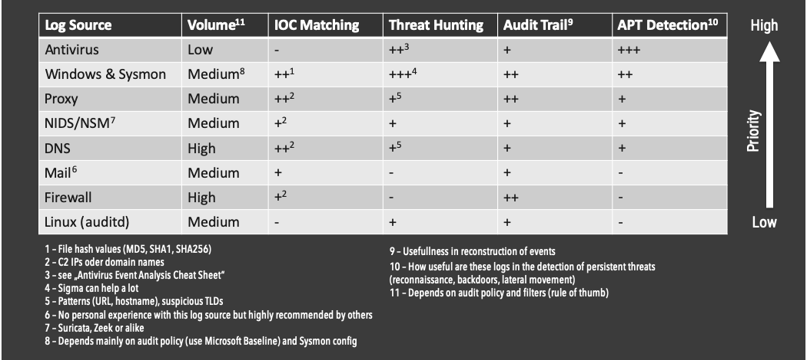
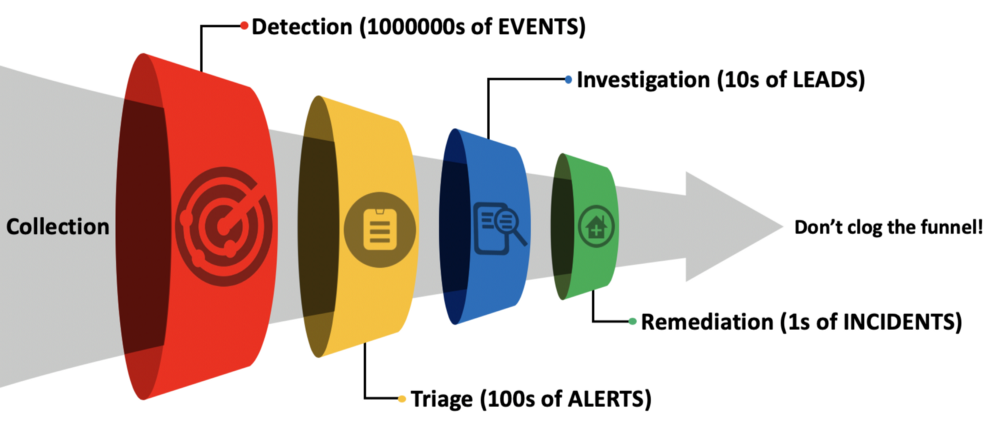
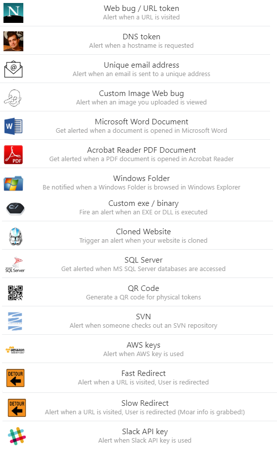
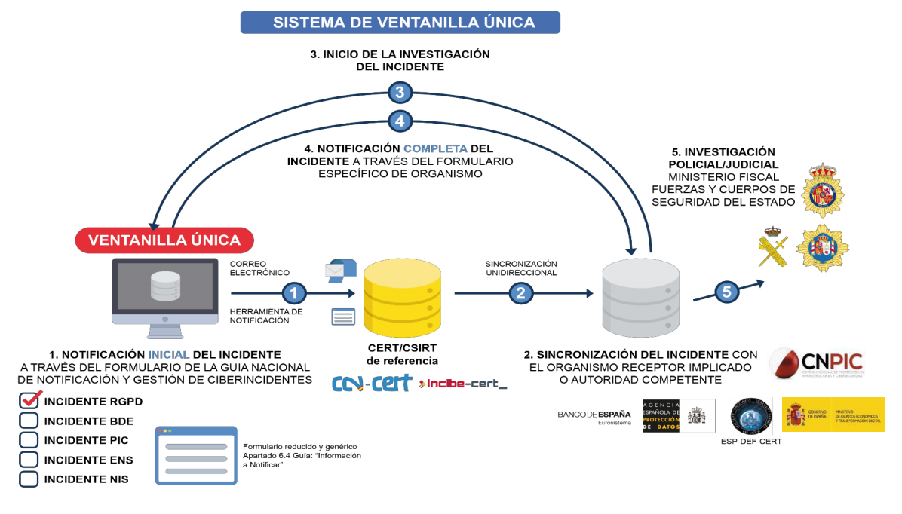
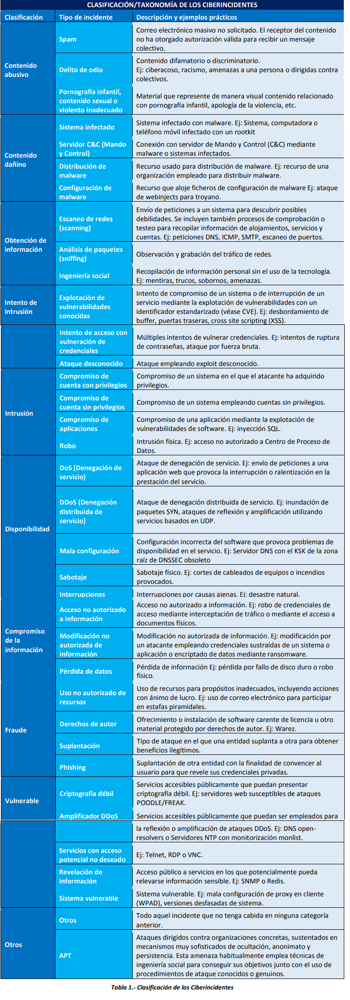
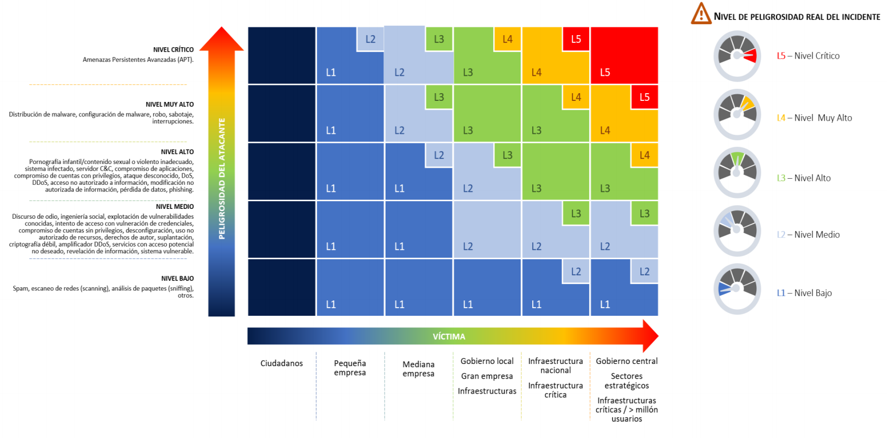

# Detección y Respuesta

[[TOC]]

## CSIRTs en España
Un equipo de respuesta a emergencias informáticas es un término histórico para un grupo de expertos que maneja incidentes de seguridad informática. "CERT" no debe usarse genéricamente como un acrónimo de este término, ya que está registrado como una marca comercial en la Oficina de Patentes y Marcas Registradas de los Estados Unidos. Por esta razón, se propone como nombre alternativo "Computer Security Incident Response Team (CSIRT), en español, equipo de respuesta a incidentes de seguridad informática.

[Equipos de Ciberseguridad y Gestión de Incidentes españoles (CSIRT)](https://www.csirt.es/index.php/es/)

## Soluciones del CCN para gestión de ciberincidentes
- [SAT-INET](https://www.ccn-cert.cni.es/gestion-de-incidentes/sistema-de-alerta-temprana-sat/sat-inet.html). Sonda del CCN para detectar tráfico malicioso y abrir incidente en LUCIA.
- [SAT-ICS](https://www.ccn-cert.cni.es/gestion-de-incidentes/sistema-de-alerta-temprana-sat/sat-ics.html) Sonda del CCN para detectar tráfico malicioso, especialmente orientado a protocolos industriales.
- [LUCIA](ccn-cert.cni.es/soluciones-seguridad/lucia.html). Gestión del ciclo de vida de los ciberincidentes.
- [CARMEN](https://www.ccn-cert.cni.es/soluciones-seguridad/carmen.html). Detección de APTs.
- [GLORIA](https://www.ccn-cert.cni.es/soluciones-seguridad/gloria.html)- SIEM.
- [MONICA](https://www.ccn-cert.cni.es/soluciones-seguridad/monica.html) - SIEM.
- [MARIA](https://www.ccn-cert.cni.es/soluciones-seguridad/maria-publico.html). Como un virustotal, pero subiendo las muestras al CCN.
- [MARTA](https://www.ccn-cert.cni.es/soluciones-seguridad/marta.html). Sandboxing para ficheros maliciosos, en la nube del CCN.
- [REYES](https://www.ccn-cert.cni.es/soluciones-seguridad/reyes.html). Inteligencia de amenazas. Compartición de IOCs.
- [CLAUDIA](https://www.ccn-cert.cni.es/soluciones-seguridad/claudia.html) - Seguridad en el endpoint integrada con CARMEN.
- [MICROCLAUDIA](https://www.ccn-cert.cni.es/soluciones-seguridad/microclaudia.html) - Protección contra código dañino tipo ransomware en los endpoints.
- [VANESA](https://vanesa.ccn-cert.cni.es/userportal/#/home/channel/5e89c77de4b02b452626aff2) Sesiones en vídeo sobre cada una de las herramientas.

## Inteligencia de amenazas - IOCs
¿Qué son los indicadores de compromiso?

Los indicadores de compromiso (IOC) son elementos observados en una red o en un sistema operativo que, con alta confianza, indica una intrusión informática. Ejemplos de IOCs son: direcciones IP, URL, hashes de ficheros, nombres de ficheros, cadenas de texto en ficheros, entradas del registro del sistema, etc. Monitorizando la presencia de indicadores de compromiso, las organizaciones pueden detectar ataques y actuar rápidamente para evitar que ocurran brechas o limitar los daños al detener los ataques en etapas anteriores.

[CCN-STIC 423 Indicadores de compromiso](https://www.ccn-cert.cni.es/series-ccn-stic/guias-de-acceso-publico-ccn-stic/1090-ccn-stic-423-indicadores-de-compromiso/file.html)

Además de elementos concretos, también se puede hablar de [indicadores de ataque](http://www.darkreading.com/attacks-breaches/top-15-indicators-of-compromise/d/d-id/1140647?) como:
- Tráfico de red saliente inusual
- Anomalías en la actividad de la cuenta de usuario privilegiado
- Irregularidades geográficas
- Inicio de sesión sospechosos
- Aumentos en el volumen de lectura de la base de datos
- Tamaños de respuesta HTML
- Gran cantidad de solicitudes para el mismo archivo
- Tráfico de aplicaciones de puerto no coincidente
- Cambios sospechosos en el registro o en los archivos del sistema
- Solicitudes de DNS inusuales
- Parcheo inesperado de sistemas
- Cambios en el perfil del dispositivo móvil
- Paquetes de datos en el lugar equivocado
- Tráfico web con comportamiento inhumano
- Señales de actividad DDoS

¿Cómo compartir IOCs?
- [REYES](https://www.ccn-cert.cni.es/soluciones-seguridad/reyes.html). Inteligencia de amenazas. Compartición de IOCs. Solo accesible para organismos públicos.
- [TAXII & STIX](https://oasis-open.github.io/cti-documentation/) Trusted Automated Exchange of Indicator Information (TAXII) y Structured Threat Information Expression (STIX).
- [MISP](https://www.misp-project.org/) Open Source Threat Intelligence Platform

Lista de recursos:
- [VirusTotal](https://www.virustotal.com/gui/home) Analyze suspicious files and URLs to detect types of malware, automatically share them with the security community
- [YARA](https://yara.readthedocs.io/en/stable/) 
- [How to write Yara Rules Guides](https://github.com/neo23x0/blueledger/blob/main/README.md#how-to-write-yara-rules-guides)
- [IOC Scanners](https://github.com/neo23x0/blueledger/blob/main/README.md#scanners)
- [IOC Bucket (gratuito)](https://www.iocbucket.com/)
- [Cisco Talos](https://talosintelligence.com/)
- [URLhaus](https://urlhaus.abuse.ch/) Sharing malicious URLs that are being used for malware distribution.
- [Recopilatorio de Threat Inteligence sources](https://github.com/hslatman/awesome-threat-intelligence)

## Análisis de malware
El análisis de malware es la práctica de determinar la funcionalidad, la fuente y el posible impacto de un malware dado, como un virus, gusano, troyano, rootkit o puerta trasera. Este análisis implica dos técnicas fundamentales: análisis estático y análisis dinámico.

### Análisis de malware estático
El análisis estático de malware implica la investigación de archivos ejecutables sin que se ejecuten realmente las instrucciones del programa. El análisis estático puede validar si un archivo es malicioso, brindar información sobre su funcionalidad y, en ocasiones, brindar información que puede permitir la creación de firmas (patrones reconocibles). Es básico y puede ser rápido, pero en su mayoría es inútil contra software malicioso sofisticado y puede pasar por alto comportamientos importantes.

Recursos interesantes sobre reversing y análisis de malware:
- [Practical Malware Analysis](https://www.jaiminton.com/Tutorials/PracticalMalwareAnalysis/) por [Jai Minton](twitter.com/CyberRaiju)
- [Reversing WannaCry Part 1 - Finding the killswitch and unpacking the malware in #Ghidra](https://www.youtube.com/watch?v=Sv8yu12y5zM)
- [Curso sobre reversing](https://www.youtube.com/channel/UCPNPSP20z4FGfgMJ71VOJjw)

### Análisis dinámico de malware
A diferencia del análisis estático, el análisis dinámico ejecuta el malware para observar sus actividades, comprender su funcionalidad e identificar indicadores técnicos que se pueden utilizar para revelar firmas. El análisis dinámico puede revelar nombres de dominio, direcciones IP, ubicaciones de rutas de archivo, claves de registro, ubicaciones de archivos adicionales y también puede clasificar la comunicación con un servidor externo controlado por el atacante para propósitos de comando y control o para descargar otros archivos de malware.

Lista de sandboxes y tutoriales, para análisis dinámico de malware:
- [Any.Run](https://app.any.run/) [EMOTET - Interactive Malware Analysis with ANY.RUN](https://www.youtube.com/watch?v=YLnBPNenH9k)
- [Hybrid Analysis](hybrid-analysis.com) [Complete your first Hybrid-Analysis](https://www.youtube.com/watch?v=PQZ2w4XVyEI)
- [Joe Sandbox](https://www.joesandbox.com/)
- [Valkyrie Sandbox](https://verdict.valkyrie.comodo.com/)
- [Cuckoo Sandbox](https://cuckoosandbox.org/) [Malware Analysis Using a Cuckoo Sandbox](https://www.youtube.com/watch?v=7Nm48OQWmA8)
- [Blueliv Community](https://community.blueliv.com/#!/sandbox) [Analyzing a malware sample with Blueliv sandbox](https://roman-ramirez.medium.com/analyzing-a-malware-sample-with-blueliv-sandbox-7145a7e6620e) by [Román Ramírez](https://twitter.com/patowc)

## Registros de actividad (gestión de logs)
Es importante tener en cuenta que no todas las fuentes de logs tienen el mismo volumen generado, ni aportan lo mismo desde un punto de vista de detección de ataques. Por tanto, es conveniente realizar un análisis coste/beneficio para establecer prioridades. Se incluye aquí, una posible lista de fuentes priorizada, elaborada por [@cyb3rops](https://twitter.com/cyb3rops/status/1221580082667499522?s=20):

A modo de ejemplo, en este documento se analizan los diferentes tipos de logs que genera un antivirus, y se destacan aquellos que pueden ser mas relevantes para la detección de amenazas: [Antivirus Event Analysis Cheat Sheet](https://www.nextron-systems.com/wp-content/uploads/2019/10/Antivirus_Event_Analysis_CheatSheet_1.7.2.pdf) elaborado por [@cyb3rops](https://twitter.com/cyb3rops/status/1221580082667499522?s=20)

Otros recursos interesantes:
- [OSSEM](https://ossemproject.com/intro.html) Es un proyecto dirigido por la comunidad que se centra principalmente en la documentación y estandarización de los registros de eventos de seguridad de diversas fuentes de datos y sistemas operativos.

## Correlación eventos - SIEM
¿Qué es un SIEM? Es un sistema de seguridad compuesto por múltiples componentes de monitorización y análisis destinados a ayudar a las organizaciones a detectar amenazas y mitigarlas. Un SIEM combina una serie disciplinas y herramientas de seguridad bajo un paraguas integral:
* Gestión de registros (LMS): herramientas utilizadas para la recopilación y el almacenamiento de registros tradicionales.
* Gestión de la información de seguridad (SIM): herramientas o sistemas que se centran en recopilar y gestionar datos relacionados con la seguridad de múltiples fuentes de datos. Estas fuentes de datos pueden ser, por ejemplo, firewalls, servidores DNS, enrutadores, aplicaciones antivirus.
* Gestión de eventos de seguridad (SEM): sistemas que se basan en la supervisión y el análisis proactivos, incluida la visualización de datos, la correlación de eventos y las alertas.

SIEM es el término que se utiliza hoy en día para un sistema de gestión que fusiona todo lo anterior en una sola capa que sabe cómo recopilar y procesar automáticamente información de fuentes distribuidas, almacenarla en una ubicación centralizada, correlacionar entre diferentes eventos y producir alertas e informes basados en esta información.

Componentes de un SIEM:
* Agregación: al representar la salida sin procesar de los procesos en ejecución en un entorno digital, los registros son la fuente perfecta para proporcionar una imagen precisa de lo que está sucediendo en tiempo real.
* Procesamiento y normalización: el mayor desafío en la recopilación de datos en el contexto de SIEM es superar la variedad de formatos de registro. Un sistema SIEM, por su propia naturaleza, extraerá datos de una gran cantidad de capas (servidores, firewalls, enrutadores de red, bases de datos), por nombrar solo algunas, cada una de las cuales registrará un formato diferente.
* Correlación: una vez recopilados, analizados y almacenados, el siguiente paso en los sistemas SIEM es el de conectar los puntos y correlacionar los eventos de las diferentes fuentes de datos. Este trabajo de correlación se basa en reglas proporcionadas por varias herramientas SIEM, predefinidas para diferentes escenarios de ataque, o creadas y ajustadas por el analista.
* Presentación: la capacidad de visualizar datos y eventos es otro componente clave en los sistemas SIEM, ya que permite a los analistas ver datos fácilmente. Los paneles que contienen múltiples visualizaciones o vistas ayudan a identificar tendencias, anomalías y monitorizar el estado general o de seguridad de un entorno. Algunas herramientas SIEM vendrán con paneles prefabricados, mientras que otras permitirán a los usuarios crear y ajustar los suyos propios.
* Mitigación y remediación: una vez que se implementan las reglas de correlación y se crean los paneles de control para proporcionar una descripción general completa del sistema, el último componente clave de un sistema SIEM es cómo se manejan los incidentes una vez identificados. La mayoría de los sistemas SIEM admiten mecanismos para contener y mitigar automáticamente los eventos de seguridad. Por ejemplo, según las reglas de correlación, se puede configurar un sistema SIEM para que comience automáticamente un proceso de escalamiento interno: ejecutar scripts que inician el proceso de contención y pasar el balón al recurso correcto en la organización activando una alerta, abriendo un ticket, etc.

Recursos interesantes::
- [SIGMA Rules](https://github.com/Neo23x0/sigma). Lenguaje para describir reglas de correlación.
- [Godmode Sigma Rule](https://gist.github.com/Neo23x0/811db09add59068a7a80273d7e5f6e0f)
- [Godmode Yara Rule](https://gist.github.com/Neo23x0/f1bb645a4f715cb499150c5a14d82b44)
- [2020. 8 WAYS TO DETECT MALICIOUS FIREWALL TRAFFIC USING SIEM](https://blueteamblog.com/8-ways-to-detect-malicious-firewall-traffic-using-siem)
- [2020. 18 WAYS TO DETECT MALCIOUS ACTIONS IN YOUR ACTIVE DIRECTORY LOGS USING SIEM](https://blueteamblog.com/18-ways-to-detect-malcious-actions-in-your-active-directory-logs-using-siem)
- [2020. Tips to improve your SIEM](https://blueteamblog.com/tips-to-improve-your-siem)
- [2020. 7 WAYS TO MONITOR YOUR ORACLE DATABASE USING SIEM](https://blueteamblog.com/7-ways-to-monitor-your-oracle-database-using-siem)
- [2020. 7 WAYS TO MONITOR YOUR OFFICE 365 LOGS USING SIEM](https://blueteamblog.com/7-ways-to-monitor-your-office-365-logs-using-siem)
- [2019. A Blue Team guide to Azure & Office 365 monitoring](https://0x00sec.org/t/a-blue-team-guide-to-azure-office-365-monitoring/14411)

## Centros de Operaciones de Seguridad (SOCs)
- [El SOC de la AGE](https://www.ccn.cni.es/index.php/es/ccn-cert-menu-es/soc-age/soc-age-faq) Preguntas y respuestas.
- [2020 Setting up a CSIR](https://www.enisa.europa.eu/topics/trainings-for-cybersecurity-specialists/online-training-material/setting-up-a-csirt) ENISA
- [2020. Expel. Performance metrics, part 1: Measuring SOC efficiency](https://expel.io/blog/performance-metrics-measuring-soc-efficiency/)
- [2020. Expel. Performance metrics, part 2: Keeping things under control](https://expel.io/blog/performance-metrics-keeping-things-under-control/)
- [2019. Introducing the Funnel of Fidelity](https://posts.specterops.io/introducing-the-funnel-of-fidelity-b1bb59b04036)
 
- [2019. 7 habits of highly effective SOCs](https://expel.io/blog/7-habits-highly-effective-socs/)
- [2020. Expel. Behind the scenes in the Expel SOC: Alert-to-fix in AWS](https://expel.io/blog/behind-the-scenes-expel-soc-alert-aws/)
- [Evaluar el nivel de madurez. SOC-CMM](https://www.soc-cmm.com/introduction/)
- [Cómo montar un SOC en casa](https://www.youtube.com/watch?v=TOnlk1AHn1Q) Alejandro Aliaga. Navaja Negra. 2019.

## Threat Hunting
- [2020. ElevenPaths. "TheTHE: The Threat Hunting Environment"](https://empresas.blogthinkbig.com/thethe-threat-hunting-environment-nuestra-herramienta-para-investigadores/)
- [2020. Blog de Menasec sobre threat hunting](https://blog.menasec.net/)
- [2020. Sesión del CCN sobre Threat Hunting](https://vanesa.ccn-cert.cni.es/userportal/#/player/vod/Uec62bde1a8764b1983d7b871811afbf5)
- [Guía de referencia sobre Movimiento Lateral](https://secureservercdn.net/160.153.138.53/x27.24e.myftpupload.com/download/Lateral-Movement-Analyst-Reference.pdf?time=1599801482)
- [Guía de referencia sobre Windows Event Log](https://secureservercdn.net/160.153.138.53/x27.24e.myftpupload.com/download/Windows-Event-Log-Analyst-Reference.pdf?time=1599801482)
- [Catching Lazarus: Threat Intelligence to Real Detection Logic - Part One](https://labs.f-secure.com/blog/catching-lazarus-threat-intelligence-to-real-detection-logic/)
- [Catching Lazarus: Threat Intelligence to Real Detection Logic - Part Two](https://labs.f-secure.com/blog/catching-lazarus-threat-intelligence-to-real-detection-logic-part-two)
- Threat hunting: cazando sin salir de casa. SecurityAtWork [ParteI](https://www.securityartwork.es/2020/09/21/threat-hunting-cazando-sin-salir-de-casa-i/) [Parte2](https://www.securityartwork.es/2020/09/25/threat-hunting-cazando-sin-salir-de-casa-ii/), [Parte3](https://www.securityartwork.es/2020/09/29/threat-hunting-iii-cazando-sin-salir-de-casa-kibana/), [Parte4](https://www.securityartwork.es/2020/10/07/threat-hunting-cazando-sin-salir-de-casa-grafiki-iv/), [Parte5](https://www.securityartwork.es/2020/10/15/threat-hunting-v-cazando-sin-salir-de-casa-jupyter-notebooks/)
- [Detecting Kerberoasting Activity](https://www.hub.trimarcsecurity.com/post/trimarc-research-detecting-kerberoasting-activity)
- [Detecting Password Spraying with Security Event Auditing](https://www.hub.trimarcsecurity.com/post/trimarc-research-detecting-password-spraying-with-security-event-auditing)
- [LogonTracer](https://github.com/JPCERTCC/LogonTracer) Herramienta del JPCERT para investigar logons en directorio activo presentándolos de forma gráfica.
- [What’s Lateral Movement?](https://hencinski.medium.com/whats-lateral-movement-71c54201140a)

## Vulnerability Disclosure y Bug Bounties
- [Security.txt](https://securitytxt.org/). Propuesta de estándar para que los investigadores puedan contactar con los responsable de seguridad de los sitios y aplicaciones web a través del fichero https://xxxx.org/.well-known/security.txt
- [Lista de bug bounties en HackerOne](https://hackerone.com/bug-bounty-programs)

## Defensa Activa (Deception)
- [MITRE SHIELD](https://shield.mitre.org/matrix/)
- [2020. The Art of the Honeypot Account: Making the Unusual Look Normal](https://www.hub.trimarcsecurity.com/post/the-art-of-the-honeypot-account-making-the-unusual-look-normal)
- [2019. How Deception Technology Can Defend Networks](https://medium.com/@eddies_47682/how-deception-technology-can-defend-networks-914864bf9f53#:~:text=Modern%20deception%20technology%20involves%20distributing,be%20accessed%20by%20anyone%20legitimately.)
- [2015. ¿Qué es la Defensa Activa?](https://www.ccn-cert.cni.es/documentos-publicos/ix-jornadas-stic-ccn-cert/1258-p2-01-defensa-activa-dbarroso/file.html)
- HoneyTokens o [CanaryTokens](https://blog.thinkst.com/p/canarytokensorg-quick-free-detection.html) 
- [Kushtaka](https://kushtaka.io/)
- [Recopilatorio recursos honeypots](https://github.com/paralax/awesome-honeypots)

<!--
Ejemplos de alertas que se pueden configurar con honeytokens:
  
-->

## Reflexiones Redteam-Blueteam-Purpleteam-Yellowteam
- [RedBluePurple](https://danielmiessler.com/study/red-blue-purple-teams/) ¿Qué significa cada color?

## Respuesta a ciberincidentes
### Procedimientos generales de alto nivel
#### Por organismos españoles
- [GUÍA NACIONAL DE NOTIFICACIÓN Y GESTIÓN DE CIBERINCIDENTES](https://www.incibe-cert.es/sites/default/files/contenidos/guias/doc/guia_nacional_notificacion_gestion_ciberincidentes.pdf) aprobada por el Consejo Nacional de Ciberseguridad. 2020.

- [CCN-STIC-817](https://www.ccn-cert.cni.es/series-ccn-stic/800-guia-esquema-nacional-de-seguridad/988-ccn-stic-817-gestion-de-ciberincidentes/file.html) Esquema Nacional de Seguridad. Gestión de ciberincidentes

<!---->

#### Por organismos internacionales
- [Computer Security Incident Handling Guide. NIST](https://nvlpubs.nist.gov/nistpubs/SpecialPublications/NIST.SP.800-61r2.pdf)

### Respondiendo a Ransomware
- [CCN-CERT BP/04 Ransomware (2018)](https://www.ccn-cert.cni.es/informes/informes-ccn-cert-buenas-practicas-bp/2088-ccn-cert-bp-04-ransomware/file.html)
 - [Ransomware Protection and Containment Strategies for Endpoints. FIREEYE](https://www.fireeye.com/content/dam/fireeye-www/current-threats/pdfs/wp-ransomware-protection-and-containment-strategies.pdf)

### Respondiendo a DDoS
- [CCN Abstract - Ataques DDoS. Recomendaciones y buenas prácticas (2020)](https://www.ccn-cert.cni.es/informes/abstracts/4925-ataques-ddos-recomendaciones-y-buenas-practicas/file.html)

### Respondiendo a brechas de seguridad
- [AEPD - Guía para la gestión y notificación de brechas de seguridad](https://www.aepd.es/sites/default/files/2019-09/guia-brechas-seguridad.pdf)

### Respondiendo a incidentes en tecnologías concretas
- [AWS Security Incident Response Guide](https://d1.awsstatic.com/whitepapers/aws_security_incident_response.pdf)
- [AWS Incident Response template. Web Application Dos/DDoS Attack](https://github.com/aws-samples/aws-incident-response-runbooks/blob/master/runbooks/runbook%20sample%20-%20DoS%20or%20DDoS%20attack.md)

### SOAR / Playbooks
Pendiente de desarrollar

### Análisis Forense
- ["Chuleta" Digital Forensics and Incident Response](https://www.jaiminton.com/cheatsheet/DFIR/#)
- [Windows Forensic Analysis](https://www.geeksforgeeks.org/windows-forensic-analysis/)
- [Linux Forensics — Some Useful Artifacts](https://medium.com/@tho.le/linux-forensics-some-useful-artifacts-74497dca1ab2)
- [Android Forensic Acquisition Techniques](https://medium.com/@lucideus/android-forensic-acquisition-techniques-lucideus-forensics-e7671dbac984)

## Otros recursos
Lista de CTFs con orientación defensiva (blue):
- [Cyberdefenders Challenges](https://cyberdefenders.org/labs/?type=ctf) Incluye investigaciones en SIEM, análisis de PCAPs, análisis de memoria, etc. La parte de Challenges es free, la parte de labs tiene coste.
- [Splunk Boss of the SOC V](https://www.splunk.com/en_us/blog/conf-splunklive/bots-v-at-conf20.html)
- [DFIR CTF Challenges - Unizar](https://ctf.unizar.es/)
- [DFIR CTF images](https://dfir.training/ctfs-images)

Recursos generales de "Blue Team":
- [Megarepositorio BlueTeam](https://github.com/fabacab/awesome-cybersecurity-blueteam)
- [30 Herramientas para BlueTeam](https://securitytrails.com/blog/blue-team-tools)
