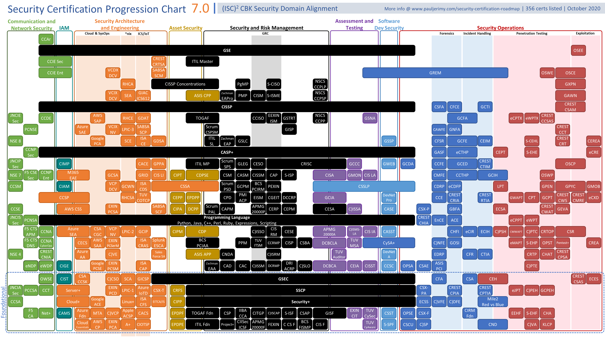

# Formación y Concienciación

[[TOC]]

## Formación en ciberseguridad

### Masters
[2019. Listado de masters en ciberseguridad compilado por INCIBE](https://www.incibe.es/sites/default/files/paginas/talento/catalogos-formacion/catalogo-masteres-ciberseguridad-feb2019.pdf)

### Cursos Online
- [C1berWall Academy](https://www.ecteg.eu/c1b3rwall-academy-es/)
- Cursos de ciberseguridad en Coursera, [English](https://www.coursera.org/courses?query=cybersecurity)
- [2019. Zero to Hero: A practical network penetration testing course](https://www.youtube.com/playlist?list=PLLKT__MCUeiwBa7d7F_vN1GUwz_2TmVQj)
- [Sesiones formativas del CCN](https://vanesa.ccn-cert.cni.es/userportal/#/home/main) VANESA.

### Certificaciones
[Enlace a imagen tamaño completo](https://i.redd.it/yo33xlys53141.png)

### Eventos de tipo competitivo
- [NATIONAL CYBERLEAGUE](https://www.nationalcyberleague.es/) Promovido por la Guardia Civil.

### Charlas generales
- [¿Qué hay en la mochila de un hacker?](https://cybercamp.es/videos/que-hay-en-la-mochila-de-un-hacker). Especial para jovenes.

## Concienciación en ciberseguridad

Recursos interesantes:
- [Concienciación del CCN-CERT - Ciberconsejos](https://www.ccn.cni.es/index.php/es/ciberconsejos)
- [Kit de concienciación de INCIBE](https://www.incibe.es/protege-tu-empresa/kit-concienciacion)
- [Kit ENISA mes europeo de la ciberseguridad](https://cybersecuritymonth.eu/press-campaign-toolbox)
- [Cuentos de Ciberseguridad](https://www.amazon.es/Cuentos-Ciberseguridad-Plural-Francisco-Perez/dp/8418155051)Libro para concienciar a niños/adolescentes.

Herramientas para hacer concienciación:
- [Gophish](https://getgophish.com/) Herramienta opensource para crear tus propias campañas de phishing simulado y concienciar a los empleados.

