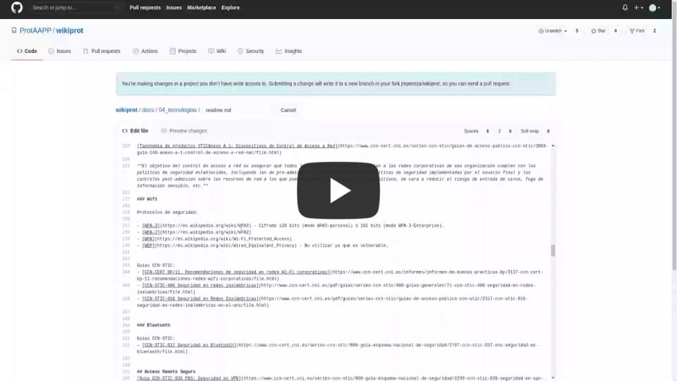

# Wiki ProtAAPP

ProtAAPP es una **comunidad** que surgió en 2018 y que integra a profesionales de las Administraciones Públicas con un denominador común: su pasión por la ciberseguridad.

ProtAAPP persigue un triple objetivo:

- Permitir la compartición de ideas, experiencias, nuevos proyectos, propuestas de colaboración, etc., en materia de ciberseguridad dentro del sector público.

- Facilitar el establecimiento de contactos y el conocimiento de profesionales con las mismas inquietudes y a quienes poder consultar, o con quienes poder colaborar.

- Ofrecer un foro de conocimiento a través del que continuar aprendiendo en múltiples sectores relacionados con la ciberseguridad: normativo, técnico, organizativo, etc.

Este repositorio trata de convertirse en un **compendio de documentación
sobre ciberseguridad**, con un enfoque dirigido al personal de las Administraciones Públicas de España.

## Requisitos 

Los requisitos para poder colaborar en el desarrollo de esta guía son:

1. Pertenecer al colectivo de personal de las Administraciones Públicas españolas.
2. Tener conocimientos básicos de git ([guía básica](https://medium.com/@sthefany/primeros-pasos-con-github-7d5e0769158c)).
3. Tener conocimientos básicos de markdown (muy muy sencillo, [aprende lo básico en 3 minutos](./requisitos-colaborar.md#aprender-markdown-en-3-minutos)).
4. Instalar [git](https://git-scm.com/downloads) en tu PC *(ó editar directamente en Github)*.
5. Instalar Node en tu PC ([explicación más detallada](./requisitos-colaborar.md#instalar-node)).
6. Instalar yarn ([cómo hacerlo en 10 segundos](./requisitos-colaborar.md#instalar-yarn)).
7. Abrirte cuenta en Github. [Crear cuenta en Github](https://github.com/join?.ref_cta=Sign+up&ref_loc=header+logged+out&ref_page=%2F&source=header-home).
8. ¡Ya está! Todo listo para insertar tu primera aportación.

## Guía de contribución a este repositorio

### Para quienes comienzan (como si estuvieras en primero)
Recuerda que has de tener cuenta en Github para poder subir código, es gratis, aquí tienes el enlace para poderte [Crear cuenta en Github](https://github.com/join?ref_cta=Sign+up&ref_loc=header+logged+out&ref_page=%2F&source=header-home)

En caso en que sea la primera vez que oyes esto de Git y Github, esta es la manera más sencilla de colaborar vía web. En el vídeo que a continuación se muestra puedes verlo:

1. Abre en el navegador [Repositorio de WikiProt](https://github.com/ProtAAPP/wikiprot).
2. Selecciona la rama master.
3. Navega por el código hasta que encuentres el fichero que quieres modificar.
4. Edítalo pulsando sobre el lápiz, si no tienes hecho login, te lo pedirá y una vez logueado ya puedes añadir o modificar.
5. Una vez que hayas terminado, añade un comentario al final y haz un "Propose Changes".
6. Comprueba lo que se ha modificado y haz un "Pull Request".
7. Revisaremos el código antes de subirlo al servidor.

### Para quienes ya saben
Si ya estás más experimentado con Git, puedes seguir está guía:

[Guía para aportar](./code_contribution_guideline.md)

